# Why do we build a frontend framework

We will focus on:

1. **Virtual DOM** - lightweight DOM representation
2. **Reconciliation Algorithm** - selects the smallest set of changes required to update the browser's DOM.
3. **SPA** - modify the URL in the browser's address bar without reloading the page. We explore the browser's *
   *_History API_**
4. Other building blocks - other stuff about frontend frameworks.

And then we combine all these things together.

<!-- TOC -->
* [Why do we build a frontend framework](#why-do-we-build-a-frontend-framework)
  * [Framework VS Library](#framework-vs-library)
  * [Our Framework Goal](#our-framework-goal)
  * [Virtual DOM Abstraction](#virtual-dom-abstraction)
    * [**Note:**](#note)
  * [Reconciliation Algorithm](#reconciliation-algorithm)
  * [Component based architecture](#component-based-architecture)
    * [Components](#components)
    * [Templates](#templates)
      * [JSX ( **JavaScript XML** )](#jsx--javascript-xml-)
      * [Directives](#directives)
  * [Advanced Features](#advanced-features)
  * [Implementation Plan](#implementation-plan)
  * [How a frontend framework works - From a Developer perspective](#how-a-frontend-framework-works---from-a-developer-perspective)
    * [Using Node.js](#using-nodejs)
  * [Bundling](#bundling)
  * [Building](#building)
    * [Building Steps](#building-steps)
  * [Deployment](#deployment)
    * [SPA - The browser Side](#spa---the-browser-side)
    * [Server-side Rendering(SSR) - The Browser Side](#server-side-renderingssr---the-browser-side)
<!-- TOC -->

## Framework VS Library

When we use a **_library_**, we import the code and the **WE** call its functions.  
But when we use a **_framework_**, we write code that **THE FRAMEWORK** executes.

The framework is in charge of running the application, and it executes our code when an appropriate trigger happens. But
with libraries, we call the library's functions when WE NEED THEM.

Examples of frameworks are:

- Angular
- Vue.js
- Next.js
- Svelte
- Preact

## Our Framework Goal

We won't build the next **React** or **Vue.js**, but we will build a simple representation just so we can learn what
things do frontend frameworks make easier and what not.  
We will borrow ideas from:

- Vue.js
- Mithril
- Svelte
- React
- Preact
- Angular
- HyperApp

## Virtual DOM Abstraction

Virtual DOM is a lightweight representation of the DOM that used to calculate the smallest set of changes required to
update the browser's DOM.  
We will use virtual DOM in our custom framework.  
**Note:**  
Not all frameworks use virtual DOM abstraction, _**Svelte**_ in particular considers it to be a **pure overhead**.

The following HTML:

```html

<div class="name">
    <label for="name-input">Name</label>
    <input type="text" id="name-input">
    <button>Save</button>
</div>
```

Will have this virtual DOM representation

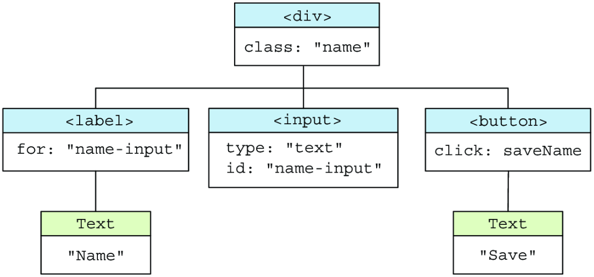

### **Note:**

The `saveName()` event handler in the figure doesn't appear in the HTML markup. Event handlers are usually added
programmatically.

## Reconciliation Algorithm

The process that decides what changes need to be made to the browser's DOM to reflect the changes in the virtual DOM

## Component based architecture

Architecture where each component does the following:

- Has his own state
- Manages its own lifecycle
- Re-renders itself and its children when their states change

### Components

Define part of the application's view and how the user interacts with it, Usually written in HTML, CSS, and JavaScript
code, Usually written in a single file(**_single file component - SFC_**)

### Templates

Code that will be compiled into JavaScript render functions

Will enable us to convert the template from HTML

```html

<div class="container">
    <h1>Look, Ma!</h1>
    <p>I'm building a framework!</p>
    <div>
```

Into JavaScript function for rendering

```javascript
function render() {
    return h('div', {class: 'container'},
        [
            h('h1', {}, ['Look, Ma!']),
            h('p', {}, ["I'm building a framework!"])
        ]
    );
}
```

Templates are done in one of two ways:

#### JSX ( **JavaScript XML** )

An extension of JavaScript.  
Used by **React** and **Preact**.

```jsx
const App = () => {
    const hasDiscount = 1;
    return (
        <div>
            {hasDiscount && <p>You get a discount!</p>}
        </div>
    );
}
```

#### Directives

Extend HTML (based) code with custom directives.  
Used by **Angular**, **Vue.js**, **Svelte**, etc...

```html
{#if hasDiscount}
<p>
    Discount!
<p>
    {/if}
```

## Advanced Features

- An SPA router that updates the URL in the browser's address bar without reloading the page.
- Slots for rendering content inside a component.
- HTML templates that are compiled into Javascript render functions.
- Server-side rendering.
- A browser extension that debugs the framework.

## Implementation Plan

To build a framework we can use an application that covers the features that we need to implement. We will make a TODO
app with our custom framework.  
We will implement the following features:

- Implement a virtual DOM;
- Mounting and unmounting;
- State Management;
- Virtual DOM reconciliation algorithm;

We can improve the framework by adding(optional and not covered during lectures):

- Stateful components;
- Subcomponents with props;
- Lifecycle hooks;
- Scheduler
- Testing

## How a frontend framework works - From a Developer perspective

it usually starts by using the framework's CLI (command line interface) tool. It installs dependencies and configures
the project.

### Using Node.js

Every frontend project is usually a <u>regular Node.js project</u>, and it has:

- a **_package.json_** file - where the projects configurations and dependencies are defined;
- the **node_modules** directory - where the dependencies files are stored;

While **_node.js**_ can be optional, developers rely on it because it has a ton of benefits like:

- run scripts;
- compiles and bundles code;
- manages dependencies;

## Bundling

Transforming the code into fewer files than originally written so that the browser can load the application by making
fewer requests to the server.

The files can be **_minified_** - made smaller by:

- Removing whitespace;
- Removing comments;
- Giving variables shorter names

## Building

Before we can deploy a frontend application to production, we need to build it. It can be done by the framework using
the CLI tool.  
Usually a **npm script**: `npm run build`

### Building Steps

- Transform the template for each component to JavaScript code;
- Bundle all component's code into a single JavaScript file, ex: `app.bundle.js`
    - Enable lazy loading if necessary;
- Bundle the third-party code that is used in `vendors.bundle.js`;
- Extract and bundle the CSS code from the components into `bundle.css`;
- Generate `index.html` to be the initial blank file that will be sent to the user, and we will later add stuff to it;
- Preprocess, optimize and copy the static assets(images,fonts,audio clips)

So a typical build process will return four files(or more if we have a larger app):

- `app.bundle.js` - the application's code;
- `vendors.bundle.js` - the third party code;
- `bundle.css` - the application's CSS code;
- `index.html` - the blank HTML file that will be server to the user;

**Note**  
If we have a larger application then we split the application's code into multiple files that are later lazily loaded(
only when needed).

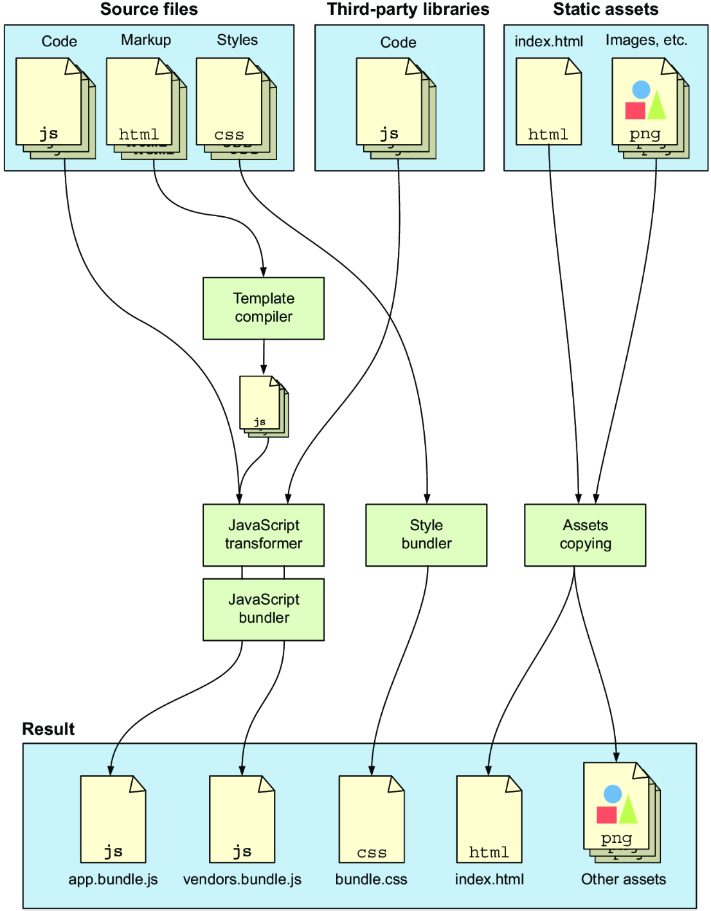

## Deployment

The generated files are uploaded to a server, and the application is ready to be served to the user.  
So when a user requests the website, the HTML,JS, and CSS are statically served.

**Note**  
We have different stuff happening depending on whether the application is **Server-side rendered (SSR)** or statically
served as an **_SPA (Single page application)_**

### SPA - The browser Side

In SPA, the server responds with a mostly empty HTML file that's used to load the application's, JavaScript and JSS
files.  
THen we use the **Document API** to create and update the application's view.  
A **router** makes sure the entire application isn't reloaded when the user navigates to a different URL.

- Updates the view and the URL in the address bar and enables navigation between different content pages while staying
  in the same html document.

**Steps**:

1. <u>**Loading the HTML file**</u> - when the user navigates to the application by writing the URL, the browser
   requests the
   page's HTML file, which is returned from the server. The browser loads the HTML file and parses it. This HTML file is
   mostly empty, is used to load the JavaScript and CSS bundles declared in the `<script>` and `<link>` tags, these
   bundles are the application and vendor files.  
   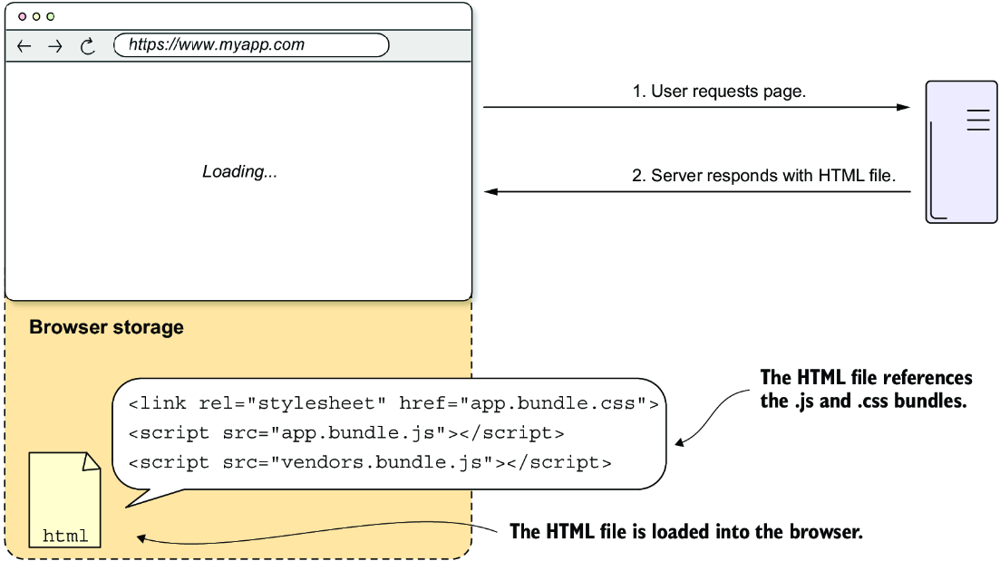
2. <u>**Loading the JavaScript and CSS files**</u> - load the JavaScript and CSS files referenced in the HTML. Parse the
   JavaScript code referenced in the HTML.  
   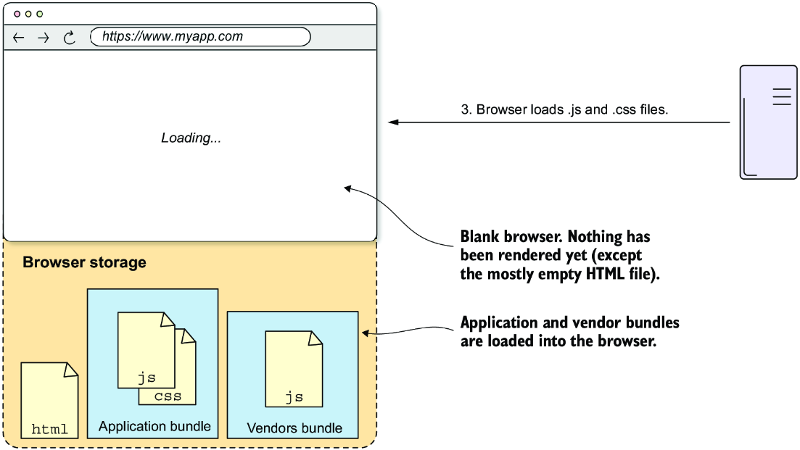
3. <u>**Creating the Application's view(mounting the app)**</u> - find the components that need to be rendered and do
   the initial rendering using the **Document API**.  
   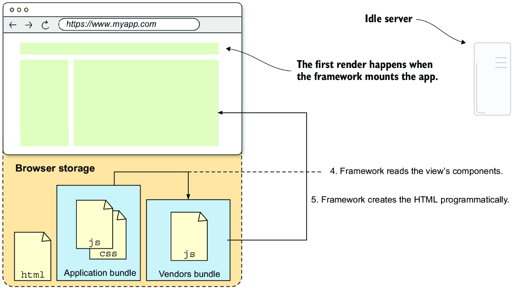
4. <u>**Handling User interactions**</u> - when the user interacts with the application, the framework handles the event
   and updates the view accordingly. The framework is responsible for updating only parts of the HTML that need to be
   updated.  
   This process is called **patching the DOM**, and the **number of updates needs to be minimal** (because it's an
   expensive process).  
   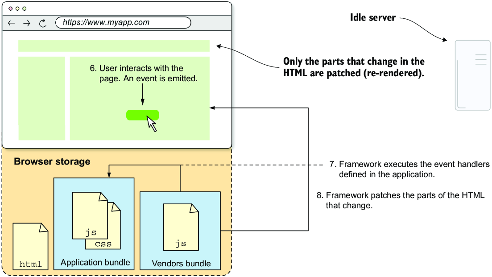

   #### Patching
   A single change that the framework makes in the DOM is called a **patch**. The process of updating the view ot
   reflect on changes in the application's state is called **patching the DOM**.

   How some frameworks update the view:
    - **Svelte** - deduces possible changes at compilation time(very good performance)
    - **Angular** - runs a change detection routine, based on <span style="font-weight: bold; color: rgb(0,120,250)">
      zones</span>.
    - Other frameworks(ex: Vue, React, Preact,...) - use a virtual DOM representation
5. <u>**Navigating Among Routes**</u> - when the user clicks a link, the framework's router prevents the default
   behaviour of the anchor tag or a button. Instead, it renders the component that's configured for the new route. The
   router is also in charge of changing the URL to reflect the new one.  
   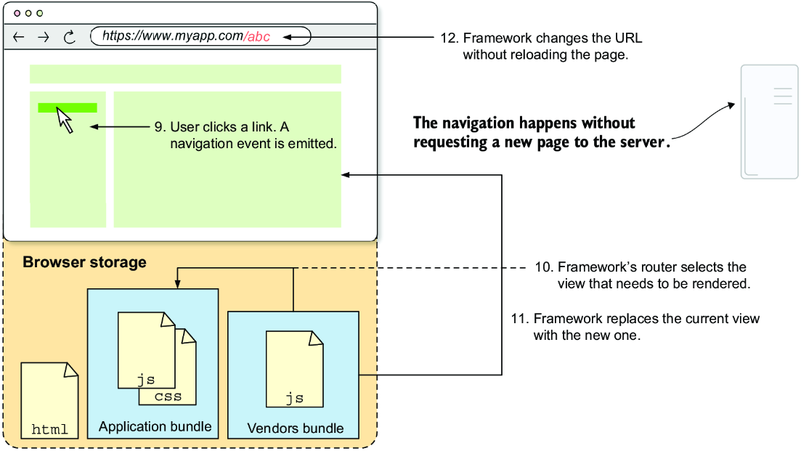

An SPA works with a single HTML file in which the HTML markup code is updated programmatically by the framework. New
HTML
pages aren't requested to the server.

**_The complete Flow of SPA_**

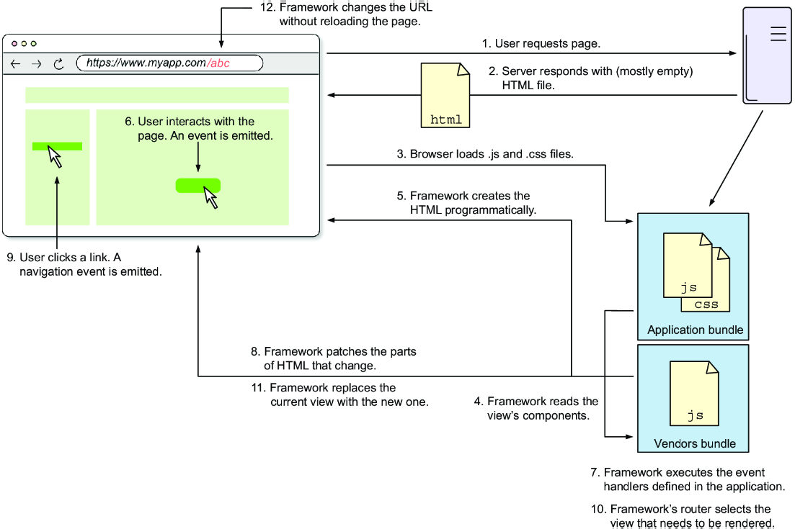

### Server-side Rendering(SSR) - The Browser Side

SSRs are web applications that render the HTML markup on the server and send it to the browser.

Backend is required to handle requests and render the HTML pages.  
Frontend code is responsible for handling user interactions, and updating the view to reflect the changes in the
application's state.

When the user navigates to a different route, the browser requests a new HTML page from the server instead of updating
the HTML markup programmatically.

**Steps**:

1. <u>**Loading an HTML page**</u>  
   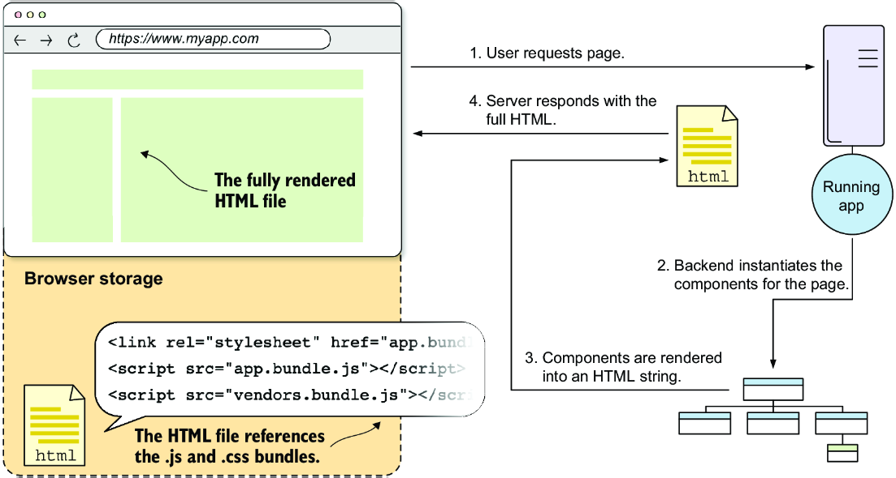  
   Even though it looks like the server returns a static HTML file to the user, this HTML file is already filled with
   data, but one thing that is missing are event handlers.  
   And that is where **HYDRATION** comes in.

2. <u>**Hydrating the HTML page**</u>  
   Hydration is a process in which the framework matches HTML tags with their corresponding virtual DOM nodes and then
   attaches event handlers the make the HTML page interactive in the browser. The hydration algorithm binds the
   browser's HTML to each component's virtual DOM, allowing for dynamic updates.  

   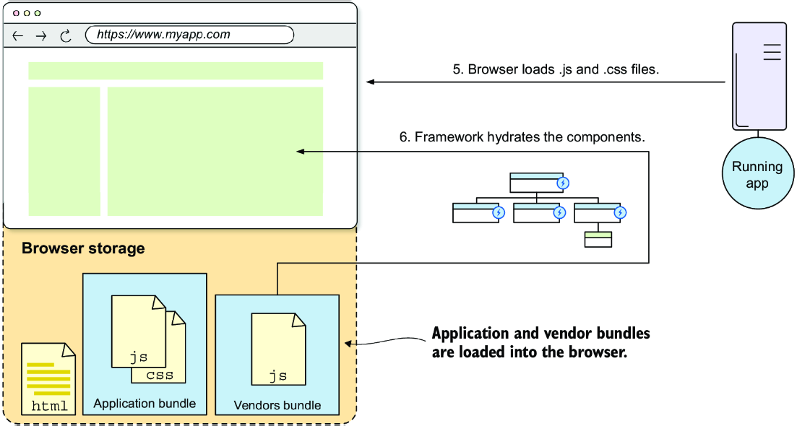
3. <u>**Handling user interactions**</u>  
   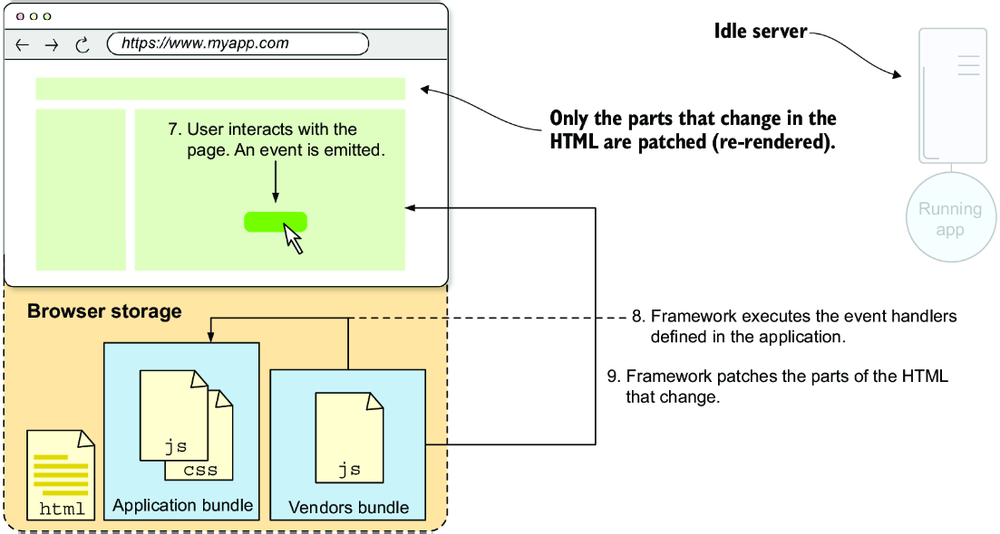
4. <u>**Navigating between routes**</u>  
   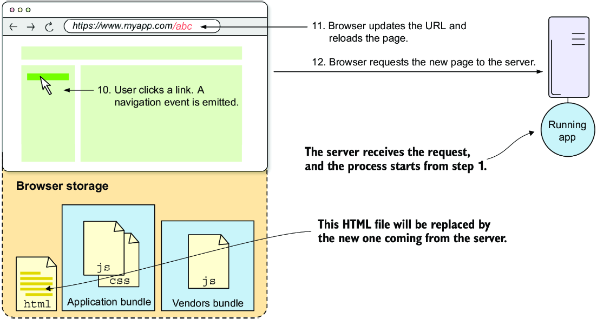

**Complete Flow of an SSR Application**

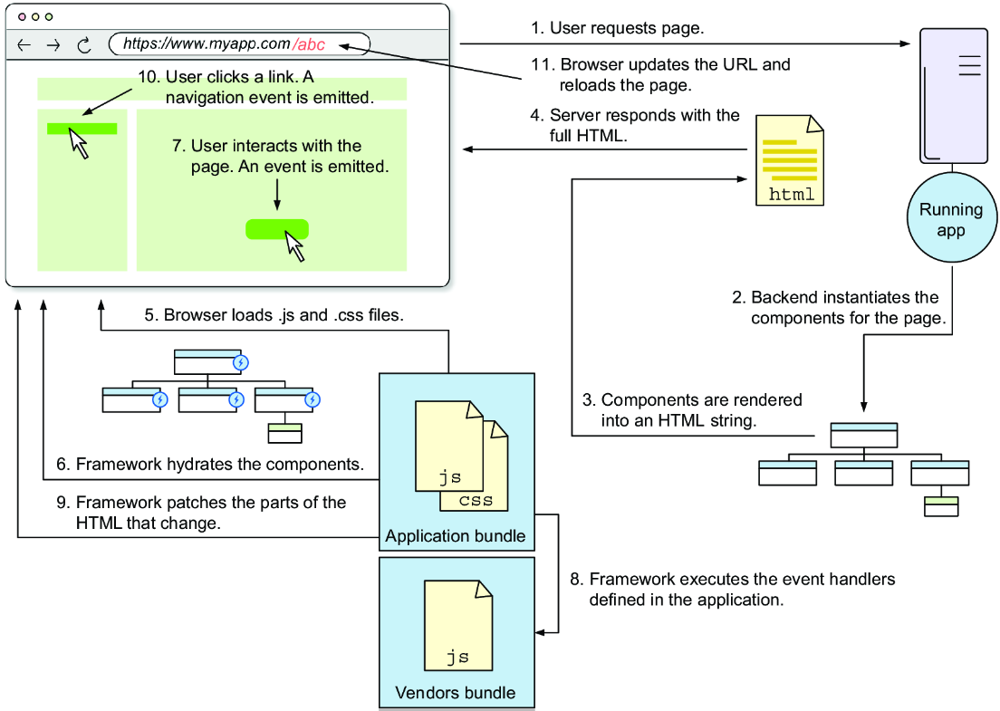
   


