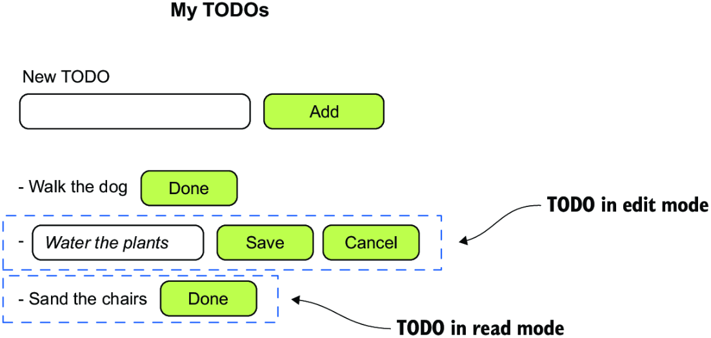
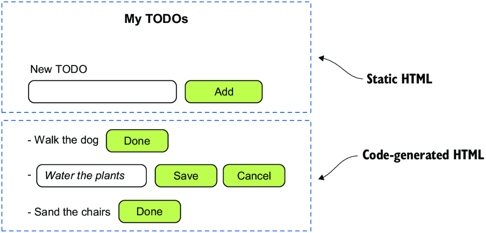
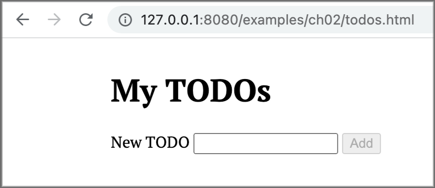

# We will build a web application using vanilla JavaScript and HTML

We will build a basic web app using vanilla js and HTML only. We will create DOM elements programmatically using the *
*Document API** to manipulate the DOM.

## Why Vanilla JavaScript

Why do we build a web app in vanilla js when we have frameworks like Vue, React, Angular.  
Well this way we can understand why those frontend frameworks exist and how do they help us and which problems they
solve? This way we may suffer and with that we will appreciate the job that frameworks do.

In the older days, apps were made with vanilla javascript, HTML and with CSS styling. **JQuery** was used to interact
with the DOM.  
THis is **still a possible way** to write applications, but in more specific cases is doable.

## THe Vanilla App

So we will build a simple app from scratch using only:

- vanilla JavaScript;
- HTML

Here we will have a **low abstraction level**.

The **main idea** is a **_TODO app_**, that will help us keep a list of the things we need to do(to-do) in a day. Each (
to-do) can be marked as **_complete_** and is removed from the list, also a (to-do) can be **_modified_** when a user
makes a typo or wants to change its description.

We have a site that shows an example of making a todo app in each framework/language, [here](https://todomvc.com/)

The mockup:



### Planning our app

Static content:

- Title (My TODOs)
- input field, label, Add button

Dynamic content generated based on application state:

- TODO list items with the buttons



### Application State

The state is the information the application keeps track of that makes it look and behave the way it does at a
particular moment.

The application will look different depending on its state as in the state we keep the to-dos list with their
information.

### Project Setup

Two files:

- `todos.html` - the HTML page for the application
- `todos.js` - the JavaScript code for the application

#### In the HTML file:

1. load the `todos.js` as an ES module, <span style="font-weight: bold; color: rgb(0,150,250)">
   deferred</span> by default;
2. Create the **input** field, the field's **label** and the **Add** button;
3. List tag where the todos will be rendered

THe static HTML for the TODOs app

```html
<!DOCTYPE html>
<html lang="en">
<head>
    <meta charset="UTF-8"/>
    <title>My TODOs</title>
    <script type="module" src="todos.js"></script>
</head>
<body>
<h1>My TODOs</h1>
<div>
    <label for="todo-input">New TODO</label>
    <input type="text" id="todo-input"/>
    <button id="add-todo-btn" disabled>Add</button>
</div>
<ul id="todos-list"></ul>
</body>
</html>
```

Example:



#### In the JavaScript file

JavaScript code:

1. Define the application state, list the todos as an array of strings;
2. Reference the DOM elements using the `document.getElementById()` function;

```js
// State of the app
const todos = ['Walk the dog', 'Water the plants',
    'Sand the chairs']
// HTML element references
const addTodoInput = document.getElementById('todo-input')
const addTodoButton = document.getElementById('add-todo-btn')
const todosList = document.getElementById('todos-list')
```

#### Generate the HTML

After this we will dynamically generate the HTML depending on the application's state, we will attach event listeners to
the DOM elements.

Generating the HTML:

- initialize the view;
- iterate iver the todos list in the application's state
- render

**Render** - means transforming data into a visual representation(something we can see).

- `renderTodoInReadMode()` for viewing, then append each element to the <ul> element;

**Event Listeners** - We will add event listeners:

- Listener to the \<input> field's **input** event, that will toggle the **disabled** tag attribute.
- Listener to the \<input> field's **_keydown_** event;
- Listener to the Add \<button> element's **_click_** event that will:
    - Call `addTodo()`;
    - clear the input field
    - Disable the Add button

##### The code of the application(in todos.js)

Here we add the event listeners for the input field('input' and 'keydown') and the button **Add** ('click'), also we
fill the data to the DOM from the state.

```js
// Initialize the view
for (const todo of todos) {
    todosList.append(renderTodoInReadMode(todo))
}
// input event on #to-do-input field
addTodoInput.addEventListener('input', () => {
    addTodoButton.disabled = addTodoInput.value.length < 3
})
// event to filter the Enter key in the #to-do-input
addTodoInput.addEventListener('keydown', ({key}) => {
    if (key === 'Enter' && addTodoInput.value.length >= 3) {
        addTodo()
    }
})

// event for clicking the Add button
addTodoButton.addEventListener('click', () => {
    addTodo()
})
```

Now we have the `addTodo` function that will add the value from the input to the state, and then reset the static input
and button fields.

```javascript
function addTodo() {
    const description = addTodoInput.value
    todos.push(description)
    const todo = renderTodoInReadMode(description)
    todosList.append(todo)
    addTodoInput.value = ''
    addTodoButton.disabled = true
}
```

Then we have the function `renderTodoInReadMode` that will create a list element with span and button and add it to the
DOM, with data from the input.

```javascript
function renderTodoInReadMode(todo) {
    // A <li> element that contains the to-do
    const li = document.createElement('li')

    // A <span> with the to-do description
    const span = document.createElement('span')
    span.textContent = todo

    // A dblclick event toggles the to-do to edit mode.
    span.addEventListener('dblclick', () => {
        const idx = todos.indexOf(todo)

        // Replaces the to-do with its edit mode version
        todosList.replaceChild(
            renderTodoInEditMode(todo),
            todosList.childNodes[idx]
        )
    })
    li.append(span)

    // A <button> to mark the to-do as done
    const button = document.createElement('button')
    button.textContent = 'Done'

    // Removes the to-do from the list\\
    button.addEventListener('click', () => {
        const idx = todos.indexOf(todo)
        removeTodo(idx)
    })
    li.append(button)
    return li
}
```

Next, we have the `renderTodoInEditMode` that will add a list element to the DOM that will have an input and update
button

```javascript
function renderTodoInEditMode(todo) {

    // <li> element that contains the to-do
    const li = document.createElement('li')

    // An <input> with the editable to-do description
    const input = document.createElement('input')
    input.type = 'text'
    input.value = todo
    li.append(input)


    // A <button> to save the changes
    const saveBtn = document.createElement('button')
    saveBtn.textContent = 'Save'
    saveBtn.disabled = input.value.length < 3

    input.addEventListener("input", () => {
        saveBtn.disabled = input.value.length < 3
    })

    // Updates the to-do description\\
    saveBtn.addEventListener('click', () => {

        // if(input.value.length > 2){
        const idx = todos.indexOf(todo)
        updateTodo(idx, input.value)
        // }

    })
    li.append(saveBtn)
    // A <button> to cancel the changes
    const cancelBtn = document.createElement('button')
    cancelBtn.textContent = 'Cancel'

    // A click event cancels the changes.
    cancelBtn.addEventListener('click', () => {
        const idx = todos.indexOf(todo)

        // Replaces the to-do with its read-mode version\\
        todosList.replaceChild(
            renderTodoInReadMode(todo),
            todosList.childNodes[idx]
        )
    })
    li.append(cancelBtn)
    return li
}
```

And plus the function `updateTodo` that will update the state of the app

```javascript
function updateTodo(index, description) {
    todos[index] = description
    const todo = renderTodoInReadMode(description)
    todosList.replaceChild(todo, todosList.childNodes[index])
}
```

And finally the `removeTodo` function that will remove the to-do from both the DOM and the state

```javascript
function removeTodo(index) {
    todos.splice(index, 1)
    todosList.childNodes[index].remove()
}
```

### Conclusion

So we can see that using the `Document API` is very burdensome to write, and we want to focus on making the manipulation
of the DOM more abstract and focus on the application's logic.

We are also mixing application logic with DOM manipulation, we can see that is overly verbose so events that change the
state must also update the DOM.


