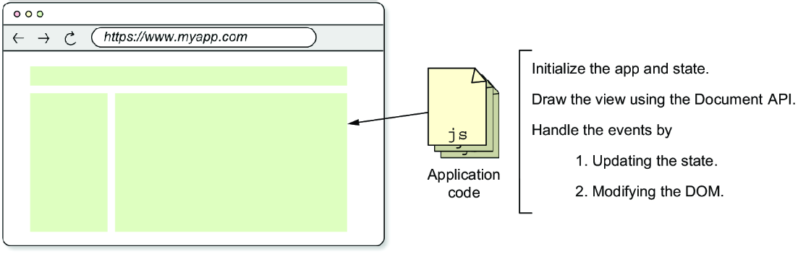
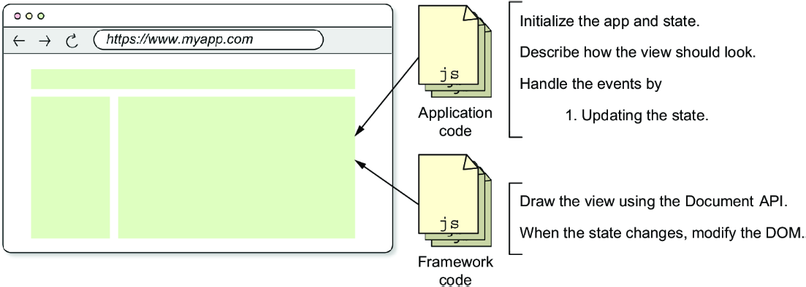
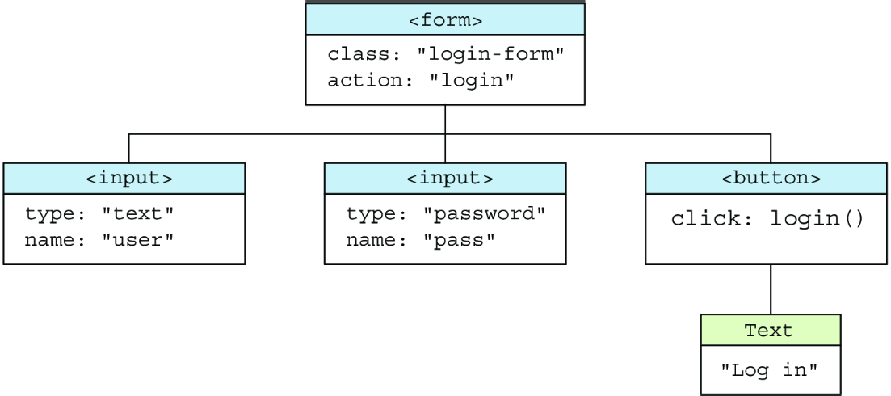
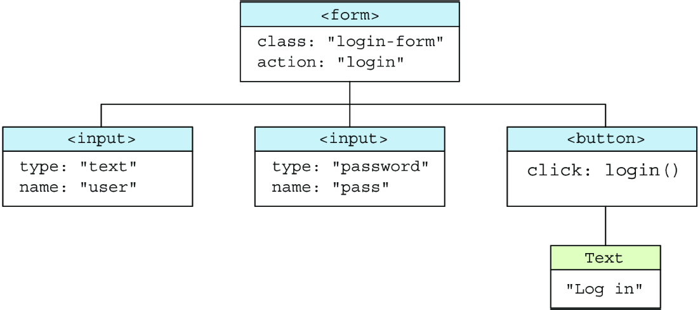
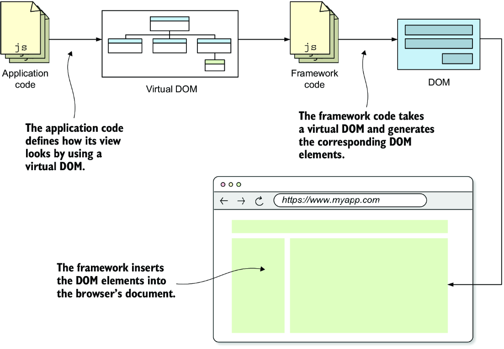
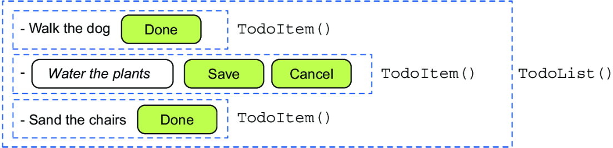
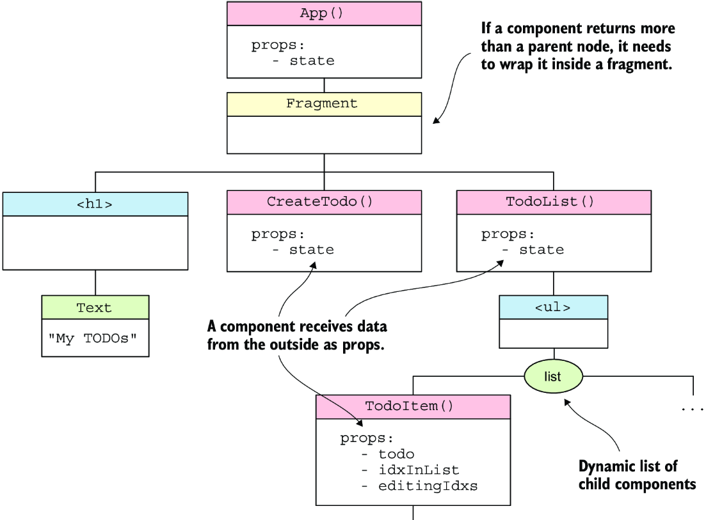

# Here we will cover the virtual DOM, its definition, understanding, implementation

<!-- TOC -->
* [Here we will cover the virtual DOM, its definition, understanding, implementation](#here-we-will-cover-the-virtual-dom-its-definition-understanding-implementation)
  * [Problems with vanilla JavaScript implementations of apps](#problems-with-vanilla-javascript-implementations-of-apps)
  * [The Virtual DOM](#the-virtual-dom)
  * [Initial setup](#initial-setup)
    * [The function `withoutNulls` in utils/arrays.js](#the-function-withoutnulls-in-utilsarraysjs)
    * [The function `mapTextNodes`](#the-function-maptextnodes)
    * [The function `hString`](#the-function-hstring)
    * [Implementation of `hFragment` function](#implementation-of-hfragment-function)
  * [Testing V-DOM functions](#testing-v-dom-functions)
  * [Components](#components)
    * [The view of an application is a generated from the state.](#the-view-of-an-application-is-a-generated-from-the-state)
  * [The application creates the V-DOM that later the framework renders it into the DOM](#the-application-creates-the-v-dom-that-later-the-framework-renders-it-into-the-dom)
    * [Hierarchy of the components for the TODO app](#hierarchy-of-the-components-for-the-todo-app)
<!-- TOC -->

## Problems with vanilla JavaScript implementations of apps

Using the **Document API** is the most burdensome to write.

We are also mixing application logic with DOM manipulation, we can see that is overly verbose so events that change the
state must also update the DOM.

We have **_imperative code_** - verbose steps of _how to do it_

So we want to improve it by:

- Abstract the manipulation of the DOM;
- Focus on the application logic
- **Declarative code** - focus on what to do, <u>_**not how**_</u>
- Create _high-level_ and _low-level_ code:
    - _high-level_ - application logic;
    - _low-level_ - DOM manipulation

Primary Goals are:

- **Separate application code** from DOM manipulation code:
  From this:  
    
  To This:  
  

**Separation of Concerns** - means splitting the code so that the parts that do different stuff are separated, which
will help the developer understand and maintain the code

This will improve:

- Developer productivity - the app dev doesn't need to write DOM-manipulation code, instead they can focus on the
  application logic;
- Code maintainability- the DOM manipulation and the application logic aren't mixed which makes the code easier to
  understand;
- Framework performance - the framework author is likely to understand how to produce efficient and optimized
  DOM-manipulation code better than the application developer does.

## The Virtual DOM

The Virtual DOM is a lightweight,in-memory representation of the actual browser's DOM. It allows describing the view in
a **declarative way**.

**Notes:**

- **DOM** - in-memory tree structure managed by the browser engine, representing the HTML structure of the web page;
    - DOM nodes are heavy objects with hundreds of properties.
- **Virtual DOM** - a JavaScript based in-memory tree of virtual nodes that mirrors the structure of the actual DOM.
    - Each node in the _virtual dom_ is called a  **_virtual node (vnode)_**. Virtual nodes are cheap and lightweight (
      basically JavaScript objects)

A virtual DOM representation of an HTML needs to contain the same information as the DOM, including:

- What nodes are in the tree and their attributes;
- The hierarchy of the nodes in the tree;
- The relative positions of the nodes in the tree;

For the following html form:

```html

<form action="/login" class="login-form">
    <input type="text" name="user"/>
    <input type="password" name="pass"/>
    <button>Log in</button>
</form>
```

We can see that the `form` element is the root node:

- Attributes: action, class
- Implicit **click** event handler
  The `input` elements have **name** and **type** attributes.

The position of the elements is important.

A proposed Virtual DOM structure

```json5
{
  type: 'element',
  tag: 'form',
  props: {
    action: '/login',
    class: 'login-form'
  },
  children: [
    {
      type: 'element',
      tag: 'input',
      props: {
        type: 'text',
        name: 'user'
      }
    },
    {
      type: 'element',
      tag: 'input',
      props: {
        type: 'password',
        name: 'pass'
      }
    },
    {
      type: 'element',
      tag: 'button',
      props: {
        on: {
          click: "() => login()"
        }
      },
      children: [
        {
          type: 'text',
          value: 'Log in'
        }
      ]
    }
  ]
}
```

Each node in the virtual DOM is an object with a **type** property, those being:

- `element` - represents the HTML tag element, ex: `<form>`,`<input>` or `<button>`;
- `text` - represents a **text** node, such as the 'Log in' text of the `<button>` element in the example
- `fragment` - represents a node that doesn't have a parent node until they are attached to the DOM.

Each type of node has a set of properties to describe it:

- **text nodes** - **_type_** and **_value(string of text)_**;
- **element virtual nodes** have:
    - **_tag_** - The tag name of the HTML element;
    - **_props_** - the attributes of the HTML element including event handlers;
    - **_children_** - ordered child leaf nodes

V-DOM representation:



## Initial setup

```
|--runtime
|   |--src
|       |--h.js
|       |--index.js
|       |--utils.js
|           |--arrays.js
```

Node types:

Inside h.js

```javascript
export const DOM_TYPES = {
    TEXT: 'text',
    ELEMENT: 'element',
    FRAGMENT: 'fragment',
}
```

A create function that creates virtual node objects:

- _React_ - **React.createElement()**
- _Vue.js_ - **h()**
- _Mithril_ - **m()**

```javascript
import {withoutNulls} from './utils/arrays'

export function h(tag, props = {}, children = []) {
    return {
        tag,
        props,
        children: mapTextNodes(withoutNulls(children)),
        type: DOM_TYPES.ELEMENT,
    }
}
```

Conditional Rendering

```
{
  tag: 'div', 
  children: [
    { tag: 'input', props: { type: 'text' } }, 
    addTodoInput.value.length > 2 ? { tag: 'button', children: ['Add'] } : null
  ]
}
```

### The function `withoutNulls` in utils/arrays.js

```javascript
export function withoutNulls(arr) {
    return arr.filter((item) => item != null)
}
```

### The function `mapTextNodes`

Mapping Strings to text nodes. Convert text strings into text virtual nodes

```javascript
// Instead of:
h('div', {}, [hString('Hello '), hString('world!')])
// write:
h('div', {}, ['Hello ', 'world!'])
```

```javascript
function mapTextNodes(children) {
    return children.map((child) => typeof child === 'string' ? hString(child) : child)
}
```

### The function `hString`

```javascript
export function hString(str) {
    return {type: DOM_TYPES.TEXT, value: str}
}
```

### Implementation of `hFragment` function

Fragment will group multiple nodes not currently attached to the DOM, Container for an array of virtual nodes. THis can
be used anywhere we want to group v-nodes without adding another node (for example: a `<div>`) that we will use as a
wrapper.

Instead of wrapping a group of elements into a needless `<div>` tag, we can wrap them into a fragment, like we did in
React with the `<>` tag that helped us in situation where we have a collection of nodes or components, but we need to
return only one component, so it those cases we wrapped that collection into a fragment that will not be shown in the
DOM, it will be ignored, and used only for grouping purposes.

```javascript
export function hFragment(vNodes) {
    return {
        type: DOM_TYPES.FRAGMENT,
        children: mapTextNodes(withoutNulls(vNodes)),
    }
}
```

## Testing V-DOM functions

Example of the V-DOM tree



```html

<form class="login-form" action="login">
    <input type="text" name="user">
    <input type="password" name="pass">
    <button>Log in</button>
</form>
```

```javascript
h('form', {class: 'login-form', action: 'login'}, [
    h('input', {type: 'text', name: 'user'}),
    h('input', {type: 'password', name: 'pass'}),
    h('button', {on: {click: login}}, ['Log in'])
])
```

## Components

They are html fragments, but as a whole they are mini applications (web pages) in itself. They have:

- their own lifecycle;
- in charge of its own rendering;
- communicate with the rest of the application by:
    - emitting events;
    - receiving **props**;

**Props** - arguments passed to a component.

But what will we do. Well we will implement a limited and simple variation of a component. Components will be **pure
functions**, that will return:

- the v-dom;
- the view of the component;
- no-state

**Pure function** - functions that don't have any side effects and always return the same result for the same input
parameters. Can be composed nicely in a way so that we can use them to build more complex functions.

### The view of an application is a generated from the state.

The view of the application is dependent of the state. Every change of the state should force reevaluation of the V-DOM,
and then every reevaluation of the V-DOM may cause an update on the DOM(view).



## The application creates the V-DOM that later the framework renders it into the DOM

Example component creation

```javascript
function App(state) {
    return hFragment([
        h('h1', {}, ['My TODOs']),
        CreateTodo(state),
        TodoList(state)
    ])
}
```

You can notice that;

- No parent node in the V-DOM contains hte header and the subcomponents;
- V-DOM creation functions are in **PascalCase**
- The **TodoList()** component is broken into **TodoItem()**

  

```javascript
function TodoList(state) {
    return h('ul', {},
        state.todos.map((todo, i) => TodoItem(todo, i, state.editingIdxs))
    )
}
```

We will have different components/subcomponents depending on the read/edit mode:

- **TodoInReadMode()**
- **TodoInEditMode()**

```javascript
// idxInList is the index of this to-do item in the list of todos.
// editingIdxs is a Set of indexes of todos that are being edited.
function TodoItem(todo, idxInList, editingIdxs) {
    const isEditing = editingIdxs.has(idxInList)
    return h('li', {}, [
        isEditing ? TodoInEditMode(todo, idxInList) : TodoInReadMode(todo, idxInList)
    ])
}
```



### Hierarchy of the components for the TODO app

A component returns a single virtual DOM node.

Tree of components:

- `App()` - root of the tree, its children are grouped in a fragment code
- `<h1>`
- `CreateTodo()`
- `TodoList()` - has a single child `<ul>` that can have multiple children of type `TodoItem()`
    - `TodoItem()` - can have one of the two children:
        - `TodoInEditMode()`
        - `TodoInReadMode()`