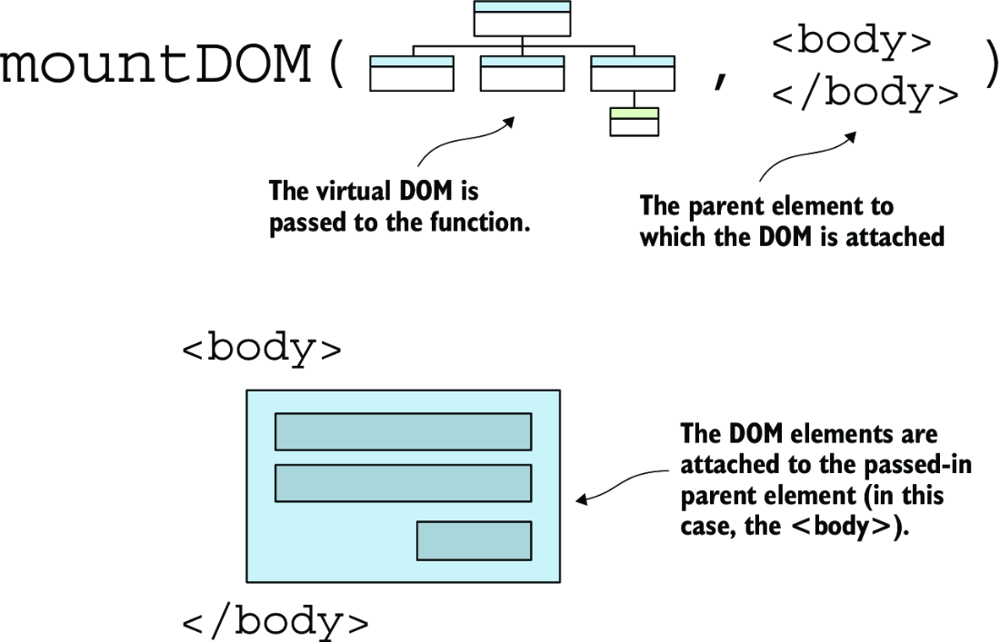
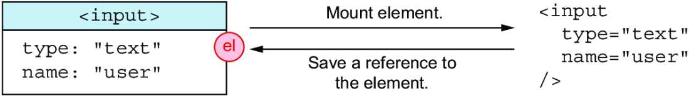
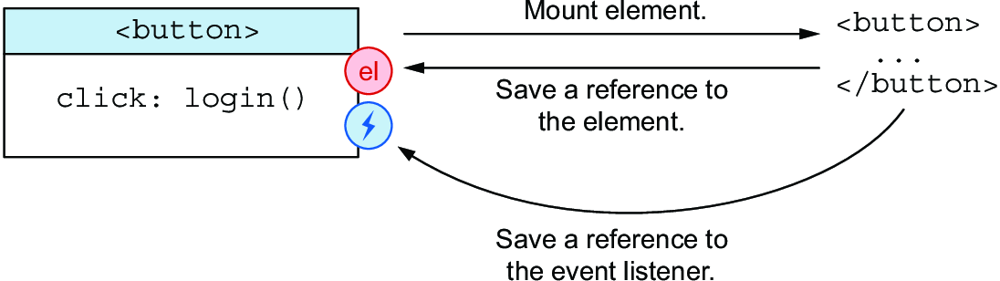
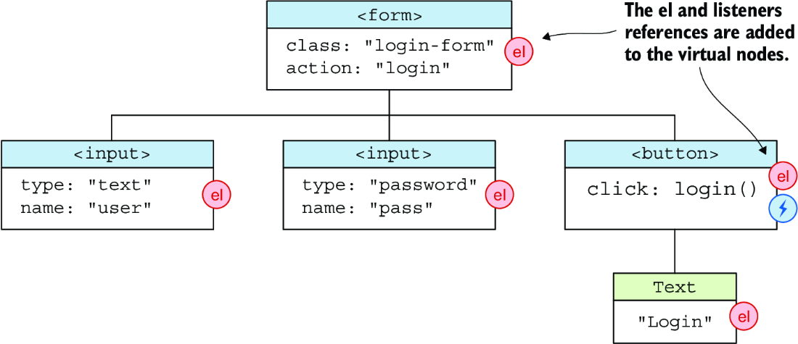
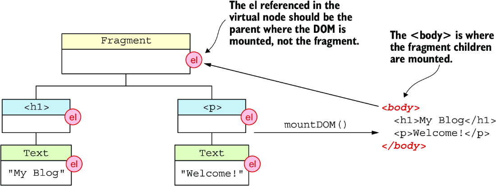
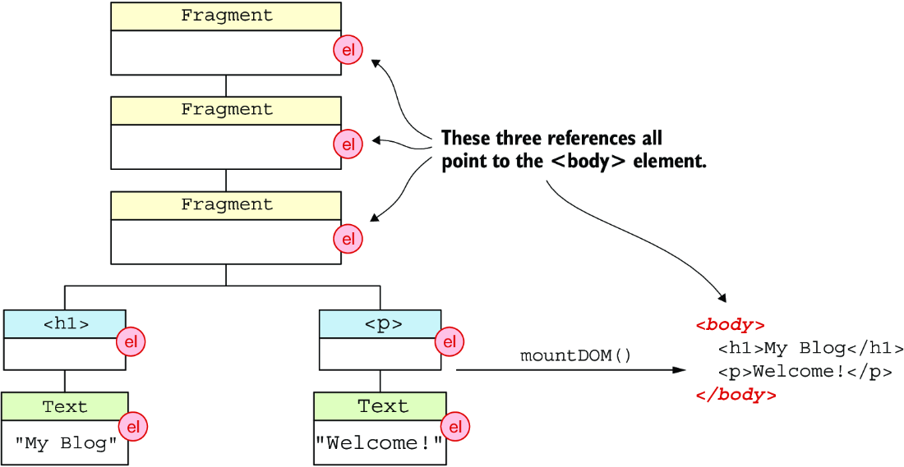
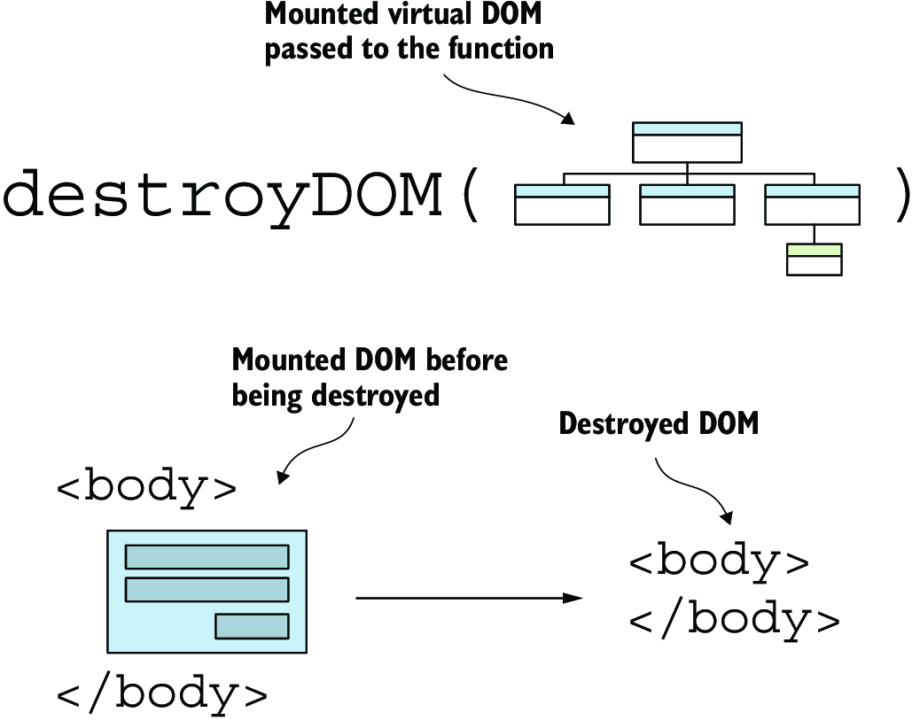
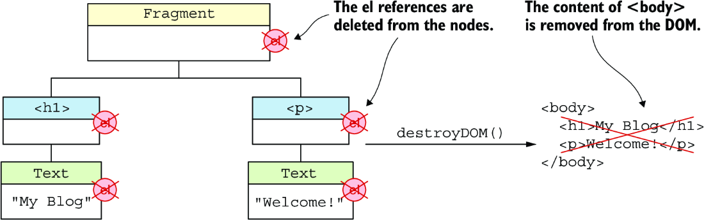
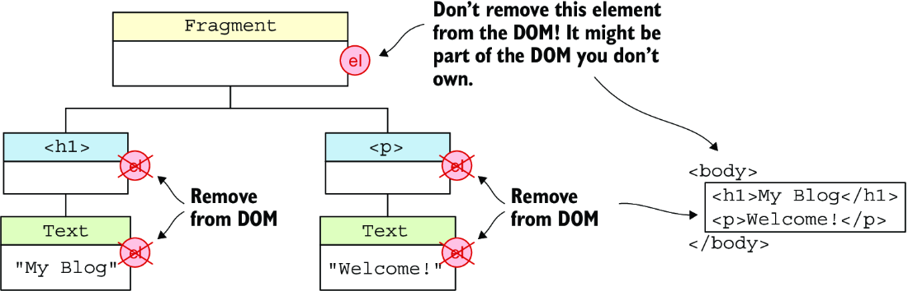

# Now we will talk about mounting the Virtual DOM

We will see how we will create HTML nodes from V-DOM nodes, insert them into the DOM, and also remove them.

<!-- TOC -->
* [Now we will talk about mounting the Virtual DOM](#now-we-will-talk-about-mounting-the-virtual-dom)
  * [Mounting the Virtual DOM](#mounting-the-virtual-dom)
    * [References](#references)
    * [Event Listeners](#event-listeners)
    * [Mounting](#mounting)
      * [Types of nodes created](#types-of-nodes-created)
      * [`mountDOM()` function](#mountdom-function)
      * [`createTextNode()` function](#createtextnode-function)
      * [`createFragmentNode()` function](#createfragmentnode-function)
      * [`createElementNode()` function](#createelementnode-function)
      * [`addEventListeners()` function and `addEventListener()` function](#addeventlisteners-function-and-addeventlistener-function)
      * [`setAttributes()` function](#setattributes-function)
        * [Some Edge Cases](#some-edge-cases)
        * [The `setClass()` function](#the-setclass-function)
          * [Using **classList**](#using-classlist)
          * [Using **className**](#using-classname)
          * [Differences between className and classList](#differences-between-classname-and-classlist)
        * [The `setStyle()` function](#the-setstyle-function)
        * [Setting the rest of the attributes](#setting-the-rest-of-the-attributes)
    * [Mounting Example](#mounting-example)
    * [Destroying the DOM](#destroying-the-dom)
      * [Considerations](#considerations)
      * [Destroying `Text Nodes`](#destroying-text-nodes)
      * [Destroying `Element Nodes`](#destroying-element-nodes)
<!-- TOC -->

## Mounting the Virtual DOM

We will create a real DOM tree for the given V-DOM tree, and then attach it to the browser's document. All of this will
be done with the framework code, so users shouldn't use the **Document API**.

We will need to create a mount function - `mountDOM()`



The first argument is the virtual DOM, then the second argument is the parent element where the view will be inserted.
For example this parent element can be the `<body>` element that will also be the root, and that is where the DOM tree
will be attached.

Example:

```javascript
const vdom = h('form', {class: 'login-form', action: 'login'}, [
    h('input', {type: 'text', name: 'user'}),
    h('input', {type: 'password', name: 'pass'}),
    h('button', {on: {click: login}}, ['Login'])
])

//Passed to the `mountDOM()`

mountDOM(vdom, document.body)
```

### References

For optimization and for easier tracking we will add a reference to the real DOM node to the V-DOM element as an `el`
property in the v-node.   
Also with the references we can remove event listeners and detach elements easier from the DOM when an element is *
*_unmounted_**.  
This way we will also know which element to update for the <u>**reconciliation algorithm**</u>.



### Event Listeners

Additionally, event listeners will be saved and then referenced via the `listeners` property in the v-node.

  

---



### Mounting

THis all will be attached to the `<body>` element

```html

<body>
<form class="login-form" action="login">
    <input type="text" name="user">
    <input type="password" name="pass">
    <button>Login</button>
</form>
</body>
```

#### Types of nodes created

- Text node - the virtual nodes of type `text` needs a **Text** node to be created (with the `document.createTextNode()`
  method)
- Element node - the virtual node of type `element` needs an **Element** node to be created(with the
  `document.createElement()` method)

#### `mountDOM()` function

````javascript
export function mountDOM(vdom, parentEl) {
    switch (vdom.type) {
        case DOM_TYPES.TEXT: { // Mounts a text vnode
            createTextNode(vdom, parentEl)
            break
        }
        case DOM_TYPES.ELEMENT: { // Mounts a element vnode
            createElementNode(vdom, parentEl)
            break
        }
        // Continued from previous slide...
        case DOM_TYPES.FRAGMENT: { // Mounts a fragment vnode
            createFragmentNodes(vdom, parentEl)
            break
        }
        default: {
            throw new Error(`Can't mount DOM of type: ${vdom.type}`)
        }
    }
}
````

#### `createTextNode()` function

We will use the provided `document.createTextNode` function to create text nodes.

```javascript
// FILE: src/mount-dom.js
function createTextNode(vdom, parentEl) {
    const {value} = vdom
    const textNode = document.createTextNode(value) // Creates text no
    vdom.el = textNode // Saves a reference
    parentEl.append(textNode) // Appends to the parent element
}
```

#### `createFragmentNode()` function

We need to mount the children of the fragment. But we <u>**_don't attach_**</u> fragment nodes to the DOM, and the `el`
element will reference the parent element, even nested fragments will all **have the same parent reference**.



  

```javascript
function createFragmentNodes(vdom, parentEl) {
    const {children} = vdom
    vdom.el = parentEl // Saves a reference to the parent element
    // Append each child to the parent element
    children.forEach((child) => mountDOM(child, parentEl))
}
```

#### `createElementNode()` function

We will use the `createElement()` method from the **Document API**, where the **Document API** will return:

- an element node that matches the tag name, or;
- **HTMLUnknownElement** if the tag is unrecognized;

So we will do:

1. Create an element node using the `document.createElement()` function;
2. Add attributes and event listeners to the element node, saving the added event handlers ina new property if the
   v-node called `listeners`;
3. Save a reference to the element node in the virtual node under the `el` property;
4. Mount the children recursively into the element node;
5. Append the element node to the parent element;

**Things to consider**

- Props hold both **attributes** and **event listeners**, so they should be handled separately;
- **style** and **class** attributes should also be treated separately

#### `addEventListeners()` function and `addEventListener()` function

We will use the `addEventListener()` method from the DOM;
Element implement the **EventTarget** interface (interface that allows element to receive events and listeners for
them.)

```javascript
export function addEventListener(eventName, handler, el) {
    el.addEventListener(eventName, handler)
    return handler
}


```

Then for all the listeners that the element can have, and we want to add them all then we use the `addEventListeners()`
function.

```javascript
export function addEventListeners(listeners = {}, el) {
    const addedListeners = {}
    Object.entries(listeners).forEach(([eventName, handler]) => {
        const listener = addEventListener(eventName, handler, el)
        addedListeners[eventName] = listener
    })
    return addedListeners
}

export function removeEventListeners(listeners = {}, el) {
    Object.entries(listeners).forEach(([eventName, handler]) => {
        el.removeEventListener(eventName, handler)
    })
}
```

#### `setAttributes()` function

Let's see look how attributes are represented into the DOM

```html
<p id="foo">Hello, world!</p>
```

If the `<p>` element is created, the **id** will be set as:

> `p.id = 'foo' `

##### Some Edge Cases

- the **value** attribute of an `<input>` isn't reflected in the rendered HTML;
- The **class** and **style** attributes should be set using special functions

```javascript
// FILE: src/attributes.js
export function setAttributes(el, attrs) {
    // Split the attributes
    const {class: className, style, ...otherAttrs} = attrs
    // Set the class attributes
    if (className) {
        setClass(el, className)
    }
    // Sets the style attributes
    if (style) {
        Object.entries(style).forEach(([prop, value]) => {
            setStyle(el, prop, value)
        })
    }
    // Set all of the other attributes
    for (const [name, value] of Object.entries(otherAttrs)) {
        setAttribute(el, name, value)
    }
}
```

##### The `setClass()` function

DOM elements has the **className** and **classList** property where:

- **className** takes a string of all the class names;
- **ClassList** takes a list of all the classes;

Both approaches are valid

```javascript
// FILE: src/attributes.js
function setClass(el, className) {
    // Clear the class attribute
    el.className = ''
    // Sets the class attribute as a string
    if (typeof className === 'string') {
        el.className = className
    }
    // Sets the class attribute as an array
    if (Array.isArray(className)) {
        el.classList.add(...className)
    }
}
```

###### Using **classList**

```html

<div></div>
```

Adding the classes: 'foo', 'bar', 'baz'

```javascript
div.classList.add('foo', 'bar', 'baz')
```

Result

```html

<div class="foo bar baz"></div>
```

###### Using **className**

```javascript
div.className = 'foo bar baz'
```

---

###### Differences between className and classList

Possible v-nodes are:

```json lines
{
  type: DOM_TYPES.ELEMENT,
  tag: 'div',
  props: {
    class: [
      'foo',
      'bar',
      'baz'
    ]
  }
}
```

Or

```json lines
{
  type: DOM_TYPES.ELEMENT,
  tag: 'div',
  props: {
    class: 'foo bar baz'
  }
}
```

##### The `setStyle()` function

We will set css styles using this function

```javascript
element.style.color = 'red'
element.style.fontFamily = 'Georgia'
```

When applied to a `<p>` element

```html
<p style="color: red; font-family: Georgia,serif;"></p>
```

```javascript
export function setStyle(el, name, value) {
    el.style[name] = value
}

export function removeStyle(el, name) {
    el.style[name] = null
}
```

##### Setting the rest of the attributes

Attributes are set using assignment to properties.  
But if we want to remove those attributes we can:

- set the value to `null`
- use the `removeAttribute()` method

```javascript
export function setAttribute(el, name, value) {
    if (value == null) {
        removeAttribute(el, name)
    } else if (name.startsWith('data-')) {
        el.setAttribute(name, value)
    } else {
        el[name] = value
    }
}

export function removeAttribute(el, name) {
    el[name] = null
    el.removeAttribute(name)
}
```

### Mounting Example

If in the javascript we give:

```javascript
const vdom = h('section', {} [
    h('h1', {}, ['My Blog']),
        h('p', {}, ['Welcome to my blog!'])
    ])
mountDOM(vdom, document.body)
```

Then we will result with this HTML

```html

<body>
<section>
    <h1>My Blog</h1>
    <p>Welcome to my blog!</p>
</section>
</body>
```

### Destroying the DOM

The elements are removed from the document

We will use the  `destroyDOM()` function to do that.



#### Considerations

- **Text Node** - remove the text node from its parent element, using the `remove()` method
- **Fragment node** - remove each of its children from the parent element(which we referenced in the `el` property of
  the
  fragment v-node)
- **Element node** - We do both things that we do in Text and Fragment nodes, and also remove the event listeners from
  the element

So we remove the `el` property from the v-node, for an element node we also remove the `listeners` property.  
But if a v-node doesn't have an `el` property , then we can assume it's unmounted from the real DOM so we don't need to
destroy it.

```javascript
export function destroyDOM(vdom) {
    const {type} = vdom
    switch (type) {
        case DOM_TYPES.TEXT: {
            removeTextNode(vdom)
            break
        }
        case DOM_TYPES.ELEMENT: {
            removeElementNode(vdom)
            break
        }
        case DOM_TYPES.FRAGMENT: {
            removeFragmentNodes(vdom)
            break
        }
        default: {
            throw new Error(`Can't destroy DOM of type: ${type}`)
        }
    }
    delete vdom.el
}
```



#### Destroying `Text Nodes`

```javascript
function removeTextNode(vdom) {
    const {el} = vdom
    el.remove()
}
```

#### Destroying `Element Nodes`


Start by removing it from the DOM.Recursively destroy the children, then remove the event listeners and delete the
`listeners` property.

```javascript
function removeElementNode(vdom) {
    const {el, children, listeners} = vdom
    el.remove()
    children.forEach(destroyDOM)
    if (listeners) {
        removeEventListeners(listeners, el)
        delete vdom.listeners
    }
}
```


#### Destroying `Fragment Nodes`

We call the `destroyDOM()` function for each child. But **DON'T remove** the `el` referenced in the fragment
vnode.

