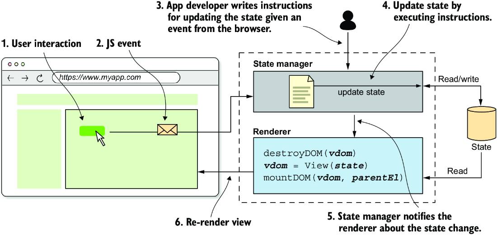
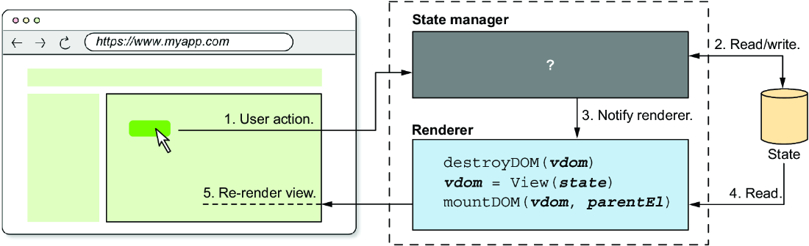
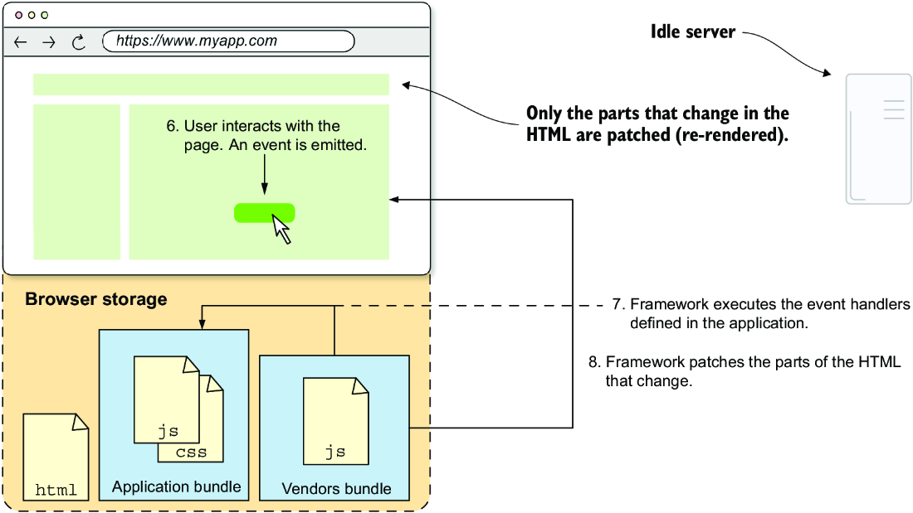
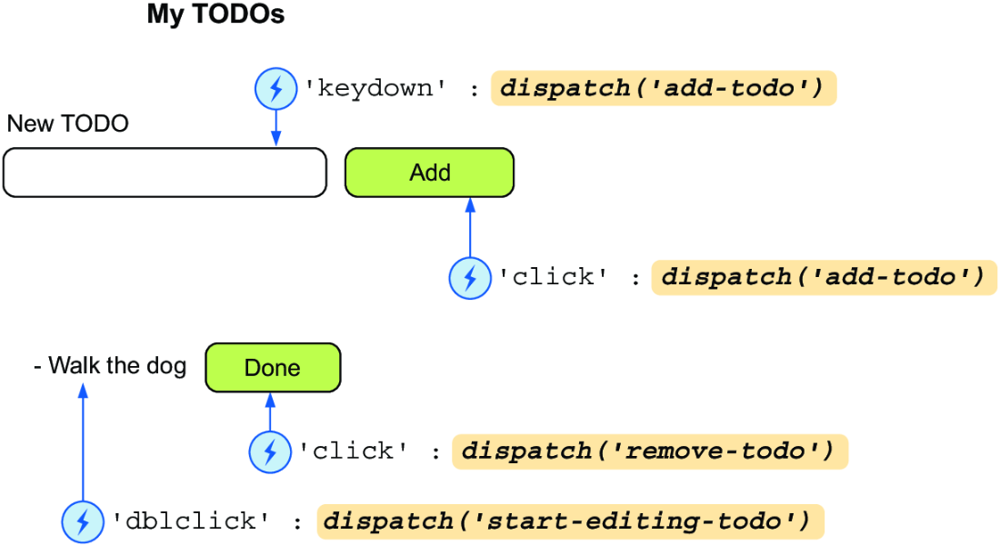
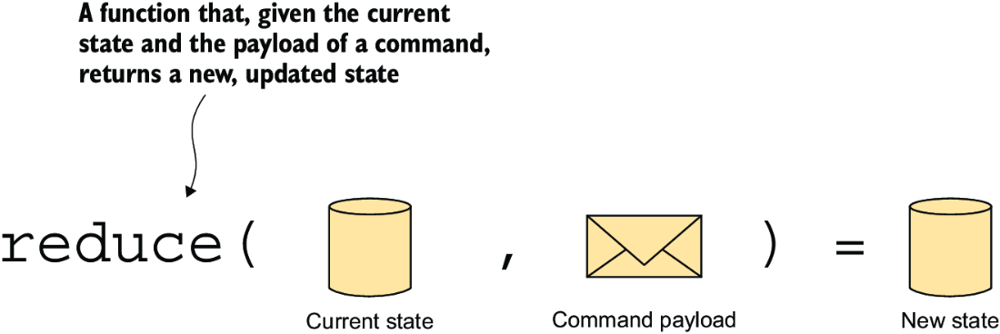
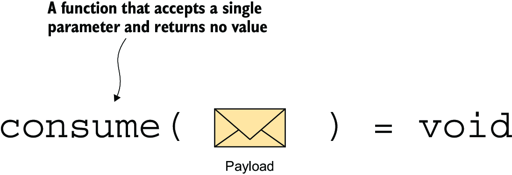
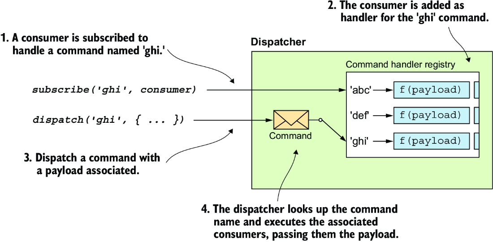
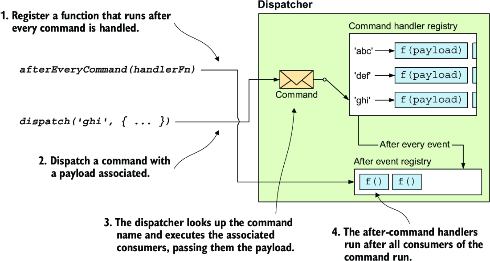
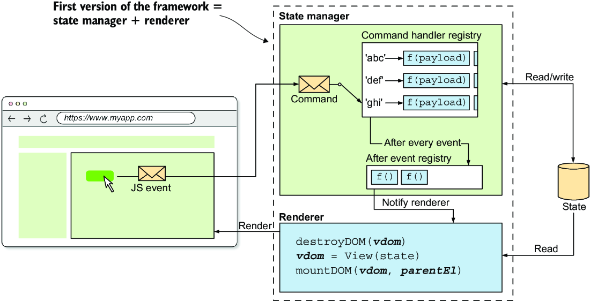
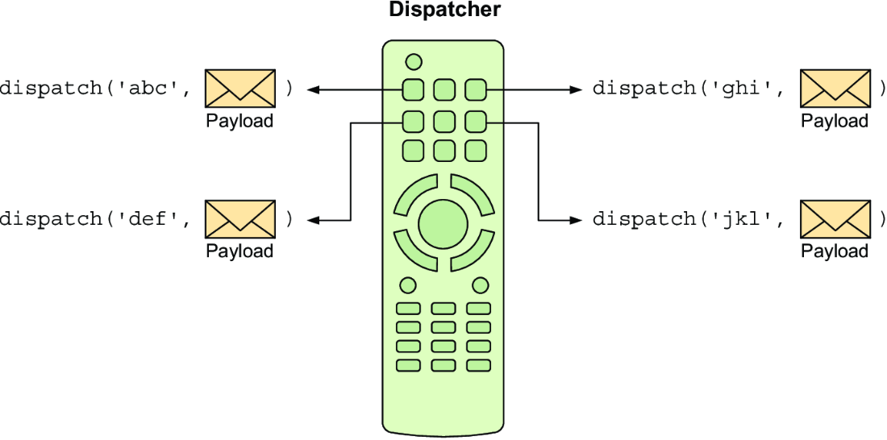

# Here we will cover state management, renderer, dispatcher

<!-- TOC -->
* [Here we will cover state management, renderer, dispatcher](#here-we-will-cover-state-management-renderer-dispatcher)
  * [State Manager](#state-manager)
    * [Chronology](#chronology)
  * [Renderer](#renderer)
  * [Events](#events)
    * [Mapping events to Domain specific commands](#mapping-events-to-domain-specific-commands)
  * [Reducer](#reducer)
  * [Dispatcher](#dispatcher)
    * [The `subscribe()` function](#the-subscribe-function)
    * [The `dispatch()` and `afterEveryCommand()` functions](#the-dispatch-and-aftereverycommand-functions)
      * [The `afterEveryCommand()` function](#the-aftereverycommand-function)
    * [The Code](#the-code)
  * [Application instance](#application-instance)
    * [The Code of the Whole `createApp()` function](#the-code-of-the-whole-createapp-function)
    * [Example of creating an application instance](#example-of-creating-an-application-instance)
<!-- TOC -->

## State Manager

The state manager keeps the application's state in sync with the view. It responds to the user input by modifying the
state accordingly, also notifies the renderer when state is changed.

### Chronology

- _the user_ - interacts with the application's view (ex: clicks a button)
- _the browser_ - dispatches a native <u>**JavaScript event**</u>, such as **MouseEvent** or **KeyboardEvent**
- _the app developer_ - programmed the framework so that it knows how to update the state for each event
- _the framework's state manager_ - updates the state according to the app developer's instructions. Also notifies the
  renderer that the state is changed
- _the framework's renderer_ - re-renders the view with a new state



Now, how can we update the state when a particular event is dispatched, and how will the state manager execute the
instructions?

## Renderer

The **Renderer** is the entity in the framework that takes the Virutal DOM and mounts it into the browser's DOM.

We implemented the _renderer_ using the `mountDOM()` and `destroyDOM()` function

Now we will implement the state manager entities and the communication between them



In this stage of the framework the renderer will destroy and mount the DOM for every state update.
THe process is:

1. Destroy the current DOM (via calling `destroyDOM()`)
2. Produce a V-DOM representing the view WITH the current state by calling the `view()` function in the top-level/root
   component.
3. Mount the V-DOM into the real DOM (by calling `mountDOM()`)

While this is not very optimized, but we will improve it when we start talking about the reconciliation algorithm

For now, we focus on handling state changes based on the user input



For now, we have made the:

- `MountDOM()` - takes a virtual DOM tree and a parent DOM element, and mounts the V-DOM into the parent element:
    - `createTextNode()` - creates HTML text nodes;
    - `createElementNode()` - creates HTML element nodes, also uses two subfunctions:
        - `addEventListeners()`;
        - `setAttributes()`;
    - `createFragmentNodes()` - creates a list of nodes that have a common parent and are directly inherited by it.
- `destroyDOM()` - takes a DOM element and removes it from the DOM. Its implementation is also broken down into a few
  subfunctions:
    - `removeTextNode()` - removes HTML text nodes.
    - `removeElementNode()` - removes HTML element nodes. This function uses another function to remove the element’s
      event listeners called `removeEventListeners()`
- `removeFragmentNodes()` - removes lists of nodes that have a common parent.

## Events

### Mapping events to Domain specific commands

We have JavaScript events, but those are generic, like: clicking a button, pressing a keyboard key, moving the
mouse...  
But we don't have event for `add Todo` , so it's the app developer's job to translate those type of events into
something
meaningful for the application to understand and execute.

So we as developers need to determine what that event needs to do and then map it to a **_command_** that the framework
can understand.

<u>**Command**</u> - is a request to do something, as opposed to an **_event_**, that is a notification of something
that has happened. These commands ask the framework to update the state, and are defined and written by the developer.

| Browser event                                           | Command     | Explanation                                                                       |
|---------------------------------------------------------|-------------|-----------------------------------------------------------------------------------|
| Click the **Add** button.                               | add-todo    | Clicking the Add button adds a new to-do item to the list.                        |
| Press the Enter key (while the input field is focused). | add-todo    | Pressing the Enter key adds a new to-do item to the list                          |
| Click the Done button.                                  | remove-todo | Clicking the Done button marks the to-do item as done, removing it from the list. |



## Reducer

**Reducer functions** will be implemented by using pure functions and making data immutable. The state is currently
immutable, so the functions should create a new state.



**Reducer** is a function that takes the current state and payload(the command's data) and returns a new updated state.
We should never mutate the state that's passed to them. Instead, we will create a **new state** (so that they remain *
*_pure functions_**). Similar to <u>**redux**</u>

Example:

To create a new version of the state when the user removes a to-do item

```javascript
function removeTodo(state, todoIndex) {
    return state.toSpliced(todoIndex, 1)
}

// For the state:
let todos = ['Walk the dog', 'Water the plants', 'Sand the chairs']
todos = removeTodo(todos, 1)
//todos = ['Walk the dog', 'Sand the chairs']
```

## Dispatcher

**Dispatcher** is an entity responsible for dispatching the commands to the functions that handle the command. The app
developer must specify with handler function(s) the system should execute in response to each command.

**Consumer** is a function that accepts a single parameter, the command's payload and returns no value.



```javascript
function removeTodoHandler(todoIndex) {
    // Calls the removeTodo() reducer function to update the state.
    state = removeTodo(state, todoIndex)
}
```

The command-handler function that removes a to-do from the list receives the to-do index as its single parameter and
calls the `removeTodo()` **reducer** function to update the state.

how can we tell the dispatcher which handler function to execute in responser to a command?

### The `subscribe()` function

This method **registers** a consumer function (the **handler function**) to respond to a command with a given name. Also
provides a mechanism to **unregister** the handler. This function takes two parameters:

- The <u>**name**</u> of the command that is being registered;
- The <u>**handler-function**</u> that will be executed when this command is issued;

The `subscribe()` function should return a function that will enable us to **unregister** the handler.

```javascript
export class Dispatcher {
    #subs = new Map()

    subscribe(commandName, handler) {
        // Creates an array of subscriptions if they don't exist for a given command name
        if (!this.#subs.has(commandName)) {
            this.#subs.set(commandName, [])
        }

        const handlers = this.#subs.get(commandName)

        // checks whether a handler is registered, if it is then we return a function that does nothing,
        // else we would have returned a function to unregister the handler
        if (handlers.includes(handler)) {
            return () => {
            }
        }

        // registers a handler
        handlers.push(handler)

        // returns a function ro unregister a handler
        return () => {
            const id = handlers.indexOf(handler)
            handlers.splice(id, 1)
        }
    }
}
```

### The `dispatch()` and `afterEveryCommand()` functions

This function executes the handler functions that is associated with a command. Here we can also add mechanism so that
we can execute **after-command** functions after every dispatch. This function takes two parameters:

- The <u>**name**</u> of the command to dispatch;
- The <u>**payload**</u> of the command;



#### The `afterEveryCommand()` function

Notice the `afterEveryCommand()` function in the [code bellow](#the-code), with that function we register every function
that we want to be executed after every dispatch request. This method takes one parameter:

- A <u>**handler-function**</u> that will be executed after each dispatch call.

Because of the stage that we are for the framework, here we can define so that the app is
re-rendered after every dispatch (assuming that the commands all alter the state).



### The Code

The whole code for the `Dispatcher`

```javascript
export class Dispatcher {
    #subs = new Map()
    #afterHandlers = []

    subscribe(commandName, handler) {
        // Creates an array of subscriptions if they don't exist for a given command name
        if (!this.#subs.has(commandName)) {
            this.#subs.set(commandName, [])
        }

        const handlers = this.#subs.get(commandName)

        // checks whether a handler is registered, if it is then we return a function that does nothing,
        // else we would have returned a function to unregister the handler
        if (handlers.includes(handler)) {
            return () => {
            }
        }

        // registers a handler
        handlers.push(handler)

        // returns a function ro unregister a handler
        return () => {
            const id = handlers.indexOf(handler)
            handlers.splice(id, 1)
        }
    }

    afterEveryCommand(handler) {

        // Registers the handler
        this.#afterHandlers.push(handler)

        // returns a function to unregister a handler
        return () => {
            const id = this.#afterHandlers.indexOf(handler)
            this.#afterHandlers.splice(id, 1)
        }
    }


    dispatch(commandName, payload) {

        // checks whether handlers are registered and calls them
        if (this.#subs.has(commandName)) {
            this.#subs.get(commandName).forEach((handler) => handler(payload))
        } else {
            console.warn(`No handlers for command ${commandName}`)
        }

        // runs the after-command handlers
        this.#afterHandlers.forEach((handler) => handler())
    }
}
```



## Application instance

The **_application instance_** is the object that manages the lifecycle of the application. It manages the state,renders
the view, and updates the state in response to user input.

App developers need to pass three things to the application instance:

- the initial state of the application;
- the reducers that will update the state in response to commands;
- The top-level/root component of the application

Then the framework will take care of:

- instantiating a renderer,state manager;
- And then wiring them together

The application instance can expose a `mount()` method that takes the root DOM element as parameter, and then will mount
the application.

Two variables in the closure of the `createApp()` function:

- **parentEl** - keep track of the DOM element
- **v_dom** - the virtual DOM tree of the previous view.

Both should be initialized to **_null_**.

`renderApp()` - function that renders the view by destroying the current DOM tree (if one exists) and then mounting the
new one.




### The Code of the Whole `createApp()` function
```javascript
// creates the application object
export function createApp({state, view, reducers = {}}) {
    let parentEl = null
    let v_dom = null

    const dispatcher = new Dispatcher()
    // rerenders the application after every command
    const subscriptions = [dispatcher.afterEveryCommand(renderApp)]

    // function that will simplify calling the dispatcher's dispatch method
    function emit(eventName, payload) {
        dispatcher.dispatch(eventName, payload)
    }

    // iterates the reducers and adds them as commands for the dispatcher to respond to
    for (const actionName in reducers) {
        const reducer = reducers[actionName]

        const subs = dispatcher.subscribe(actionName, (payload) => {
            // updates the state calling the reducer function
            state = reducer(state, payload)
        })

        // adds each command subscription to the subscriptions array
        subscriptions.push(subs)
    }

    // function that mounts and renders the virtual-dom
    function renderApp() {
        // if a previous view exists, it unmounts it
        if (v_dom) {
            destroyDOM(v_dom)
        }

        v_dom = view(state, emit)
        // mounts the new view
        mountDOM(v_dom, parentEl)
    }

    // returns a closure instance that will have methods for mount and unmount 
    return {
        mount(_parentEl) {
            parentEl = _parentEl
            renderApp()
        },
        unmount() {
            destroyDOM(v_dom)
            v_dom = null
            subscriptions.forEach((unsubscribe) => unsubscribe())
        }
    }
}
```

### Example of creating an application instance

```javascript
const app = createApp({
        state: 0,
        view: (state, emit) => hFragment([
            h("h1", {class: "title"}, ["My Counter"]),
            h("div", {
                    class: "container",
                    style: {
                        display: "flex",
                        justifyContent: "space-around",
                        width: "auto"
                    }
                },
                [
                    h("button", {
                        on: {
                            click: () => emit('decrement', 1)
                        }
                    }, ["decrement"]),
                    h("span", {}, [hString(state)]),
                    h("button", {
                        on: {
                            click: () => emit('increment', 1)
                        }
                    }, ["increment"])
                ])
        ]),
        reducers: {
            increment: (state, amount) => state + amount,
            decrement: (state, amount) => state - amount,
        }
    }
)

app.mount(document.body)

// setInterval(() => {
//     app.unmount()
// },5000)
```

The resulting HTML, event listeners are not shown.

```html
<body>
<h1 class="title">My Counter</h1>
<div class="container" style="display: flex; justify-content: space-around; width: auto;">
    <button>decrement</button>
    <span>0</span>
    <button>increment</button>
</div>
</body>
```

