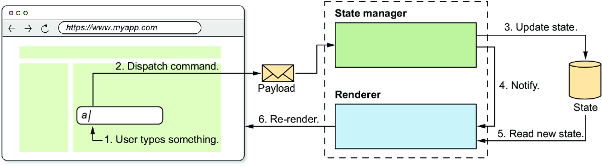

# We will see how we can refactor and then publish our framework

<!-- TOC -->
* [We will see how we can refactor and then publish our framework](#we-will-see-how-we-can-refactor-and-then-publish-our-framework)
  * [Building and publishing the framework](#building-and-publishing-the-framework)
  * [Refactoring the TO-DO app](#refactoring-the-to-do-app)
    * [Cleanup in the HTML file](#cleanup-in-the-html-file)
    * [Refactoring the `todo.js` file](#refactoring-the-todojs-file)
      * [Defining the application's state](#defining-the-applications-state)
      * [Defining the reducers](#defining-the-reducers)
      * [Defining the view](#defining-the-view)
        * [The `App` Component](#the-app-component)
        * [The `CreateTodo` component](#the-createtodo-component)
        * [The `TodoList` component](#the-todolist-component)
        * [The `TodoItem` component](#the-todoitem-component)
      * [Putting everything together](#putting-everything-together)
<!-- TOC -->

## Building and publishing the framework

We will first export the functions we want to expose to the developer. We can use `src/index.js` file.

The file `src/index.js` is the entrypoint of the build process, everything exported will be available in the final file.

Currently, the developers need to use :

- `h()`, `hString()`, `hFragment()` functions to create virtual DOM nodes.
- `createApp()` function to create an application.

So in the `src/index.js` file we:

```javascript
export {createApp} from './app'
export {h, hFragment, hString} from './h'
```

Then we run the **_build_** script inside the runtime workspace to build the framework:
> npm run build

This script bundles the JavaScript code into a single ESM file:

- `dist/</fwk-name/>.js` where `</fwk-name/>` is the **name** property in the 'package.json' file.

Also, we need to set up a npm account to publish our package. We need to set the **_version_** property in '
package.json' file to `1.0.0` and then we can publish with:
> npm publish

And the package can be directly usable from:
> packages / runtime / dist / </fwk-name/>.js

And if published then we can install it with:
> npm install </fwk-name/>

## Refactoring the TO-DO app

### Cleanup in the HTML file

We need to clean up the structure in the HTML file so that the body tag is empty inside

```html
<!-- FILE: todos.html -->
<!DOCTYPE html>
<html lang="en">
<head>
    <meta charset="UTF-8"/>
    <script type="module" src="todos.js"></script>
    <title>My TODOs</title>
</head>
<body>
<!-- The body is empty now -->
</body>
</html>
```

### Refactoring the `todo.js` file

We will import the functions exported by the framework from the **dist** directory

```javascript
// FILE: to-do.js
import {createApp, h, hFragment, hString} from 'https://unpkg.com/<fwk-name>'
```

#### Defining the application's state

In the state we will hold:

- **todos** - array of to-do items
- **currentTodo** - the text of the new to-do item that the user is typing in the input field
- **edit** - an object containing:
    - **id** - the index of the to-do item in the **todos** that is being edited
    - **original** - the original text of the to-do item before the user started editing
    - **edited** - the text of the to-do item as the user is editing it

```javascript
import {
    createApp, h, hFragment
} from 'https://unpkg.com/<fwk-name>@1'

const state = {
    currentTodo: '',
    edit: {
        idx: null,
        original: null,
        edited: null,
    },
    todos: ['Walk the dog', 'Water the plants'],
}
```

#### Defining the reducers

- <u>**Update the current to-do**</u> - the user types a new character in the input field, so the current to-do needs to
  be updated;
- <u>**Add a new to-do**</u> - the user clicks the **Add** button to add a new to-do to the list;
- <u>**Start editing a to-do**</u> - the user double-clicks a to-do item to start editing it;
- <u>**Edit a to-do**</u> - the user types a new character in the input field while editing a to-do item;
- <u>**Save an edited to-do**</u> - the user finishes editing a to-do and saves the changes;
- <u>**Cancel editing a to-do**</u> - the user cancels editing a to-do and discards the changes;
- <u>**Remove a to-do**</u> - the user marks a to-do as completed so that it can be removed from the list
- <u>**Cross out a to-do**</u> - the user marks a to-do as completed, but this time it is not removed, only it is
  crossed out and cannot be edited anymore and the **Done** button disappears.

```javascript
const reducers = {
    // receives the currentTodo as payload
    'update-current-todo': (state, currentTodo) => ({
        ...state, currentTodo //updated the current TO-DO in the state
    }),
    // Sets the currentTodo to be empty, to clear the input field
    'add-todo': (state) => ({
        ...state,
        currentTodo: "",
        todos: [...state.todos, state.currentTodo] // adds the current to-do in the todos list
    }),

    // we receive the id of the to-do to edit as payload
    'start-editing-todo': (state, id) => ({
        ...state,
        edit: {
            id,
            original: state.todos[id],
            edited: state.todos[id] // the edited version of the TO-DO is the current TO-DO
        }
    }),

    // the reducer receives the edited TO-DO as payload
    'edit-todo': (state, edited) => ({
        ...state,
        edit: {...state.edit, edited} // updates the edited TO-DO in the state
    }),

    'save-edited-todo': (state) => {
        //copied the TODOs array
        const todos = [...state.todos]

        //replaces the edited TO-DO in the TODOs array
        todos[state.edit.id] = state.edit.edited

        return {
            ...state,
            edit: {id: null, original: null, edited: null},  //resets the edit part in the state
            todos
        }
    },

    'cancel-editing-todo': (state) => ({
        ...state,
        edit: {id: null, original: null, edited: null} //resets the edit part in the state
    }),

    // reducer receives the id of the TO-DO to remove as payload
    'remove-todo': (state, id) => ({
        ...state,
        todos: state.todos.filter((_, i) => i !== id) // filters out the TO-DO with the given index
    }),

    'cross-todo': (state, id) => ({
        ...state, finished: [...state.finished, id]
    })
}
```

#### Defining the view

We will split the application into components. We can remember that now components not only take in the state, but also
the `emit()` functions that will enable them to dispatch commands.

The top-level component will be called `App()`, and is a fragment containing:

- the Title(a `<h1>` element);
- `CreateTodo()` component containing the input for adding new to-do and **Add** button;
- `TodoList()` component that will be an unordered list of items that will inside will how a collection of `TodoItem()`
  components.

##### The `App` Component

```javascript
function App(state, emit) {
    return hFragment([
        h("h1", {}, ['My TODOs']),
        CreateTodo(state, emit),
        TodoList(state, emit)
    ])
}
```

##### The `CreateTodo` component

```javascript
function CreateTodo({currentTodo}, emit) {
    return h("div", {}, [
        h("label", {for: 'todo-input'}, ['New TODO']),
        h('input', {
            type: 'text',
            id: 'todo-input',
            value: currentTodo,
            autofocus: true,
            on: {
                input: ({target}) => emit('update-current-todo', target.value),
                keydown: ({key}) => {
                    if (key === 'Enter' && currentTodo.length >= 3) {
                        emit('add-todo')
                    }
                }
            }
        }),
        h("button", {
            disabled: currentTodo.length < 3,
            on: {
                click: () => emit('add-todo')
            }
        }, ["Add"])
    ]);
}
```

We can see that in the input field above we have a **_two-way binding_**, where changes made in the input field are set
in the state and changes made in the state are set in the input. With emit we alter the state and the value in the input
is from the state.



##### The `TodoList` component

This component is simple, only having a single `<ul>` element with a list of `TodoItem()` components.

```javascript
function TodoList({todos, edit, finished}, emit) {
    return h("ul", {}, todos.map((todo, i) => TodoItem({todo, i, edit, finished}, emit)));
}
```

##### The `TodoItem` component

We have two variables inside that define the item view:

- `isEditing` - is for setting if the item is in edit mode;
- `isFinished` - is for setting if the item is marked as complete, so it will be crossed out, cannot be edited anymore
  and the **Done** button will disappear;

```javascript
function TodoItem({todo, i, edit, finished}, emit) {
    const isEditing = edit.id === i

    const isFinished = finished.includes(i)

    return isFinished ? h("li", {}, [
        h("span", {
            style: {
                textDecoration: "line-through"
            },

        }, [todo]),
    ]) : isEditing ? h("li", {}, [
        h('input', {
            value: edit.edited,
            on: {
                input: ({target}) => emit("edit-todo", target.value)
            }
        }),
        h("button", {
            on: {
                click: () => emit('save-edited-todo')
            }
        }, ["Save"]),
        h("button", {
            on: {
                click: () => emit('cancel-editing-todo')
            }
        }, ["Cancel"])
    ]) : h("li", {}, [
        h("span", {
            style: {
                textDecoration: isFinished ? "line-through" : ""
            },
            on: {
                dblclick: () => emit('start-editing-todo', i)
            }
        }, [todo]),
        h("button", {
            on: {
                click: () => emit('cross-todo', i)
            }
        }, ["Done"])
    ])
}
```

#### Putting everything together

```javascript
createApp({state,reducers,view: App})
    .mount(document.body)
```