# Now we will cover how we can compare two V-DOM trees, differences between two objects,arrays and sequence of steps to transform an array to another

<!-- TOC -->
* [Now we will cover how we can compare two V-DOM trees, differences between two objects,arrays and sequence of steps to transform an array to another](#now-we-will-cover-how-we-can-compare-two-v-dom-trees-differences-between-two-objectsarrays-and-sequence-of-steps-to-transform-an-array-to-another)
  * [Analogy](#analogy)
  * [Current implementation of managing the view](#current-implementation-of-managing-the-view)
  * [The reconciliation algorithm](#the-reconciliation-algorithm)
    * [Comparing two V-DOM trees](#comparing-two-v-dom-trees)
      * [Depth-first Search (DFS)](#depth-first-search-dfs)
    * [Changes in the Rendering](#changes-in-the-rendering)
      * [The `patchDOM()` function](#the-patchdom-function)
    * [Diffing Objects](#diffing-objects)
    * [Diffing Arrays](#diffing-arrays)
    * [Diffing arrays as a sequence of operations (The Algorithm)](#diffing-arrays-as-a-sequence-of-operations-the-algorithm)
      * [The Algorithm](#the-algorithm)
        * [Example](#example)
      * [Algorithm Implementation](#algorithm-implementation)
        * [`ARRAY_DIFF_OP`](#array_diff_op)
        * [`ArrayWithOriginalIndices` class](#arraywithoriginalindices-class)
        * [`arraysDiffSequence` function](#arraysdiffsequence-function)
        * [The Remove Case and `isRemoval()` & `removeItem` methods inside `ArrayWithOriginalIndices` class](#the-remove-case-and-isremoval--removeitem-methods-inside-arraywithoriginalindices-class)
        * [The noop Case and `originalIndexAt()` & `isNoop()` & `noopItem()` methods inside `ArrayWithOriginalIndices` class](#the-noop-case-and-originalindexat--isnoop--noopitem-methods-inside-arraywithoriginalindices-class)
        * [The Addition Case and `findIndexFrom()` & `isAddition()` & `addItem()` methods inside `ArrayWithOriginalIndices` class](#the-addition-case-and-findindexfrom--isaddition--additem-methods-inside-arraywithoriginalindices-class)
        * [The Move Case and `moveItem()` method inside `ArrayWithOriginalIndices` class](#the-move-case-and-moveitem-method-inside-arraywithoriginalindices-class)
        * [Remove Remaining elements case](#remove-remaining-elements-case-)
      * [Algorithm Whole Code](#algorithm-whole-code)
        * [`arraysDiffSequence()` function](#arraysdiffsequence-function-1)
        * [`ArrayWithOriginalIndices` class](#arraywithoriginalindices-class-1)
  * [Summary](#summary)
<!-- TOC -->

## Analogy

The analogy is similar to updating a shopping list

Where if we have another list, we don't just rewrite again, only compare and add or remove what is missing in the new
one.

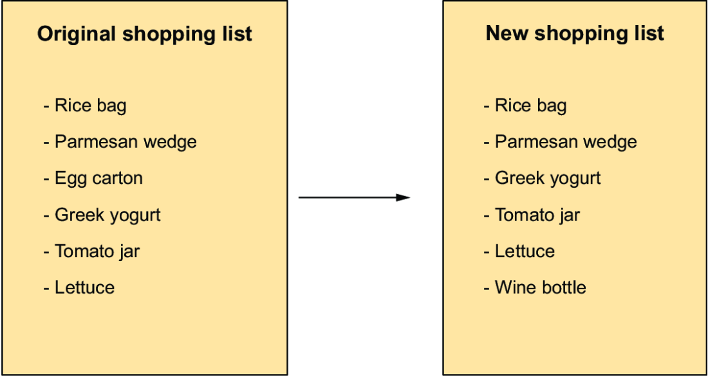

## Current implementation of managing the view

Currently, we destroy and mount the DOM everytime we have a change, and that is expensive and not optimized at all.

We want to figure out what is changed and only apply those changes, making the process more efficient.

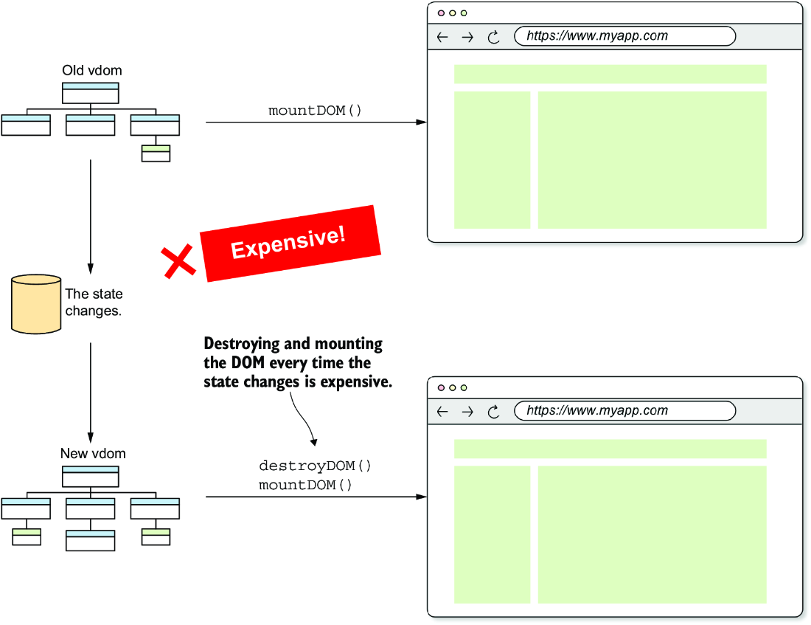
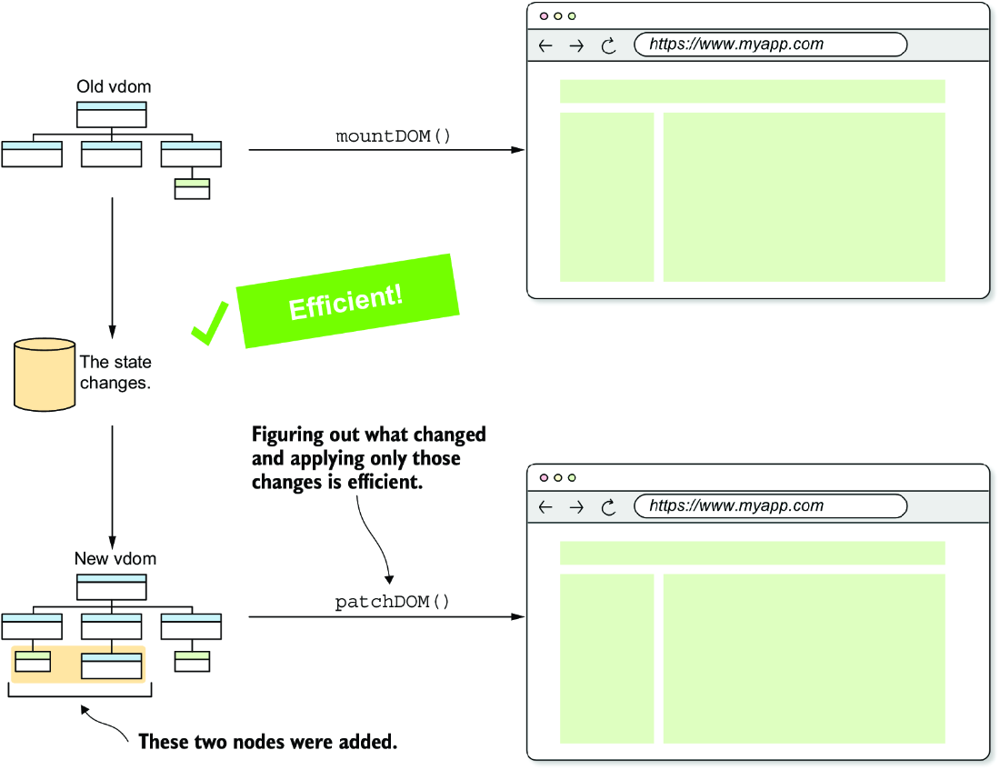

## The reconciliation algorithm

Function to find the differences between two objects and return:

- the keys that were added;
- the keys that were removed;
- the keys whose associated values changed;

Function to find the differences between two arrays, returning:

- the items that were added;
- the items that were removed;

Function that given two arrays, figures out a sequence of operations to apply to the first array and transform it into
the second array.

### Comparing two V-DOM trees

The view is the function of the state, on state changes, the V-DOM represents the view changes.

The reconciliation algorithm compares the old V-DOM with the new V-DOM after state changes, so we:

- reconcile the two V-DOM trees;
- figure out what changed and apply those changes to the real DOM

To compare two V-DOM trees we can start comparing the two root nodes, checking if they are equal, also checking if their
attributes or listeners have changed.

Then if changes are detected, destroy the subtree where the root is the old node and replace it with a new node and
everything under it.

Then compare the children of the two nodes, traversing recursively in a **_DEPTH-FIRST MANNER_**.

#### Depth-first Search (DFS)

Depth-first traversal is the natural order in which the DOM is modified.

DFS ensures changes are applied to a complete branch of the tree before moving to the next.

Traveling this way is important for **_fragments_**:

- The children of a fragment are added to the fragment's parent;
- If the number of children changes, the change could potentially alter the indexes where the siblings of the fragment's
  parent are inserted;

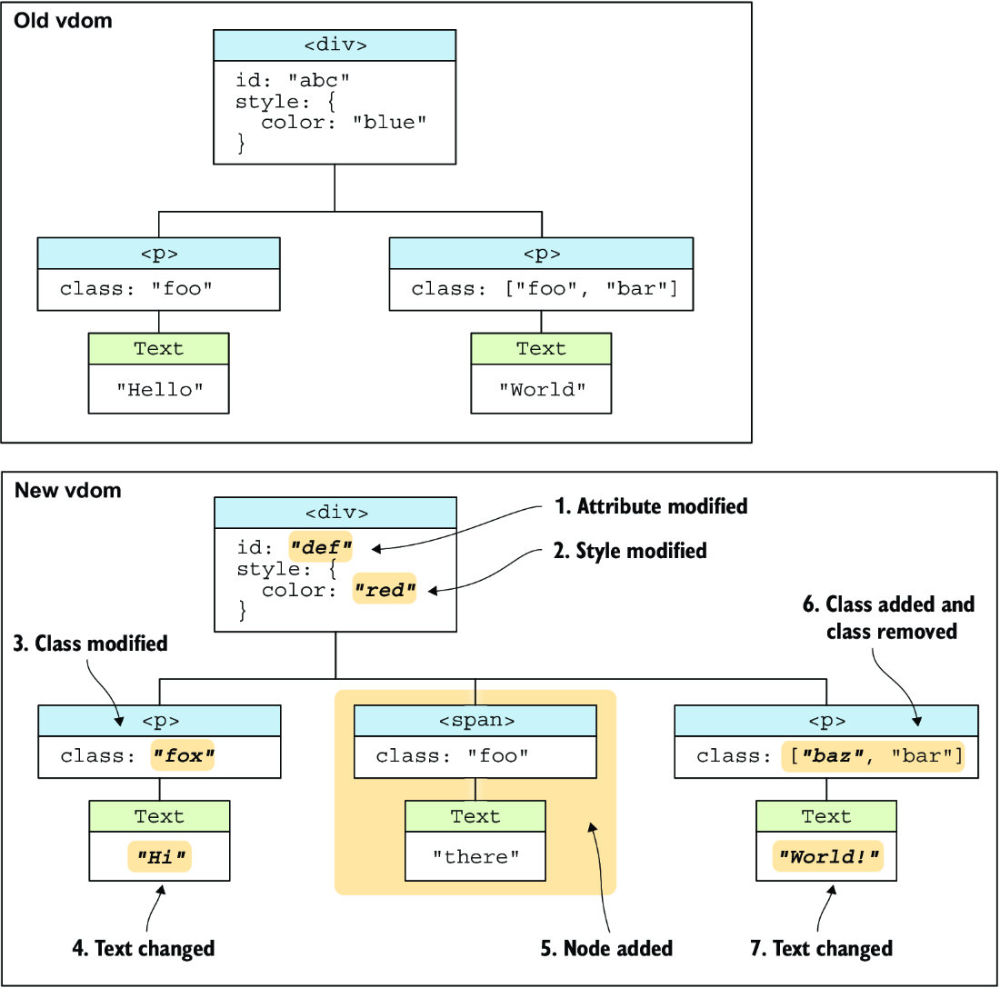

Comparison steps:

1. **_Compare the root nodes_** - we can see that the **id** attribute changed from 'abc' to 'def', also the **style**
   attribute changed from "color: blue" to "color: red"  
   
2. **_Compare the children of the root one by one_** - we can see that the `<p>` element is the same in both trees, but
   the **class** attribute changed from "foo" to "fox"  
   
3. **_Compare the grandchildren from the children_** - we can see that the text content has changed from "Hello" to "
   Hi";  
     
   ...

### Changes in the Rendering

The `render()` function will now be split into three sections:

- mounting - with the `mount()` function;
- patching - with the `patchDOM()` function inside `renderApp()`;
- unmounting;

The `mount()` method doesn't need to use the `renderApp()` function anymore;

The `renderApp()` function is called only when the state changes;

`mount()` calls the `view()` function to get the V-DOM and then calls the `mountDOM()` function to mount the DOM. This
function should be called only once.

```javascript
let isMounted = false
// ...
return {
    mount(_parentEl) {

        if (isMounted) {
            throw new Error("The application is already mounted");
        }

        parentEl = _parentEl
        v_dom = view(v_dom, emit)
        mountDOM(v_dom, parentEl)
        isMounted = true

        // renderApp()
    },
    unmount() {
        destroyDOM(v_dom)
        v_dom = null
        subscriptions.forEach((unsubscribe) => unsubscribe())

        isMounted = false
    }
}
```

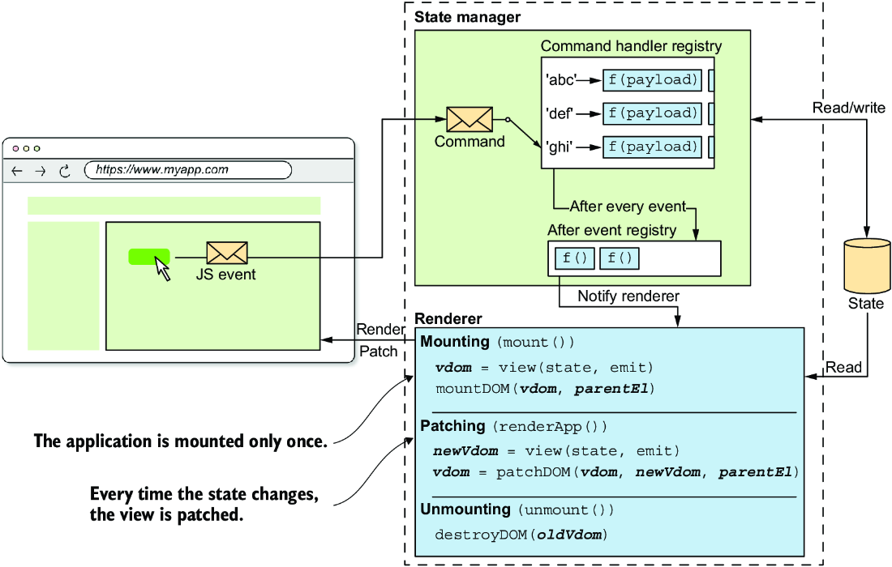

#### The `patchDOM()` function

This function takes:

- the last saved V-DOM (stored in `v_dom`);
- the new virtual DOM resulting from calling the `view()` function;
- the parent element(stored in the `parentEl` variable) of the DOM;

### Diffing Objects

Find the differences between the attributes of the two nodes, this is called **_diffing_**.

When diffing objects we track:

- added keys;
- removed keys;
- updated keys;

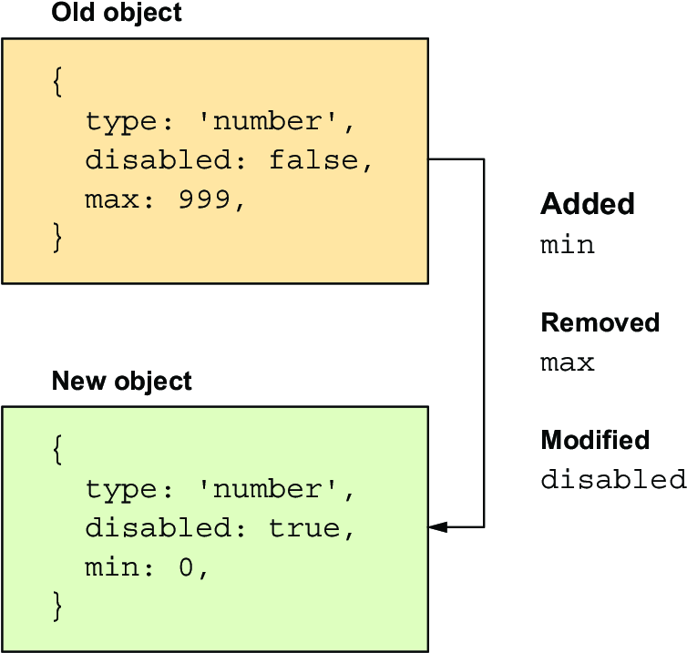

The steps:

1. Take a key in the old object. If you don’t see it in the new object, you know that the key was removed. Repeat with
   all keys.
2. Take a key in the new object. If you don’t see it in the old object, you know that the key was added. Repeat with all
   keys.
3. Take a key in the new object. If you see it in the old object and the value associated with the key is different, you
   know that the value associated with the key changed.

```javascript
// FILE: utils/objects.js
export function objectsDiff(oldObj, newObj) {
    const oldKeys = Object.keys(oldObj);
    const newKeys = Object.keys(newObj);

    return {
        // Keys in the new object that are not present in the old object
        added: newKeys.filter((key) => !(key in oldObj)),

        // Keys in the old object that were present, but they aren't now in the new object
        removed: oldKeys.filter((key) => !(key in newObj)),

        // Keys in both objects that are present but have different values
        updated: newKeys.filter((key) => key in oldObj && oldObj[key] !== newObj[key])
    }
}
```

### Diffing Arrays

Useful for diffing array based props (e.g. class)

When diffing arrays we track:

- added keys;
- removed keys;

If an item is changed we **_remove the old item_** and **_add the new item_**, **_NO MOVING_**.

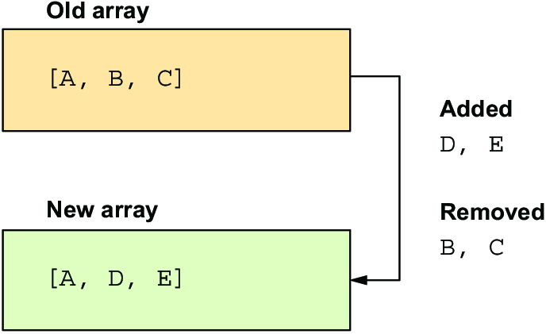

```javascript
// FILE: utils/arrays.js
export function arraysDiff(oldArray, newArray) {
    return {
        // Items in the new array that are not in the old array were added
        added: newArray.filter((newItem) => !oldArray.includes(newItem)),

        // Items in the old array that are not in the new array were removed
        removed: oldArray.filter((oldItem) => !newArray.includes(oldItem))
    }
}
```

The order can be **PROBLEMATIC** because some classes override a prerequisite class, so for TODO we can try to improve
that.

### Diffing arrays as a sequence of operations (The Algorithm)

For two arrays,we have to come up with a list of **add**, **remove**, and **move** operations that transform the first
array into the second one.

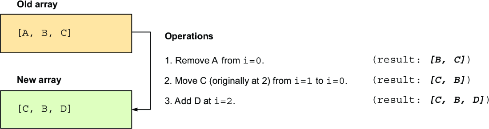

We **NEED** to keep track of the original indexes of items.

Operations for transformation of arrays are:

- **add**;
- **remove**;
- **move**;
- **noop (no operation)** - when an item is in both arrays at the same position

Operations variables meaning:

- **op** - indicates the type of operation
- **item** - the item that is added,moved,removed
- **index** - the index where the item **ends up**, or when removing from where it was removed
- **originalIndex** - the index where the item was initially, used in `move` and `noop`
- **from** - used in `move` operation
  Operations example:

```
add - { op: 'add', item: 'D', index: 2}

remove - {op: 'remove', item: 'B', index:0}

move - {op:'move', item: 'C',originalIndex: 2,from:2,index:0}

noop - { op: 'noop', item:'A',originalIndex:0, index: 1}
```

#### The Algorithm

1. Iterate over the indices of the new array:
    - Let i be the index (0 ≤ i < newArray.length).
    - Let **newItem** be the item at i in the new array.
    - Let **oldItem** be the item at i in the old array (provided that there is one).
2. If **oldItem** doesn’t appear in the new array:
    - Add a <u>**remove operation**</u> to the sequence.
    - Remove the **oldItem** from the array.
    - Start again from step 1 without incrementing i (stay at the same index).
3. If **newItem** == **oldItem**:
    - Add a <u>**noop operation**</u> to the sequence, using the **oldItem** original index (its index at the beginning
      of the process).
    - Start again from step 1, incrementing i.
4. If **newItem** != **oldItem** and **newItem** can’t be found in the old array starting at **i**:
    - Add an <u>**add operation**</u> to the sequence.
    - Add the newItem to the old array at **i**.
    - Start again from step 1, incrementing **i**.
5. If **newItem** != **oldItem** and **newItem** can be found in the old array starting at **i**:
    - Add a <u>**move operation**</u> to the sequence, using the oldItem current index and the original index.
    - Move the **oldItem** to i.
    - Start again from step 1, incrementing i.
6. If **i** is greater than the length of **newArray**:
    - Add a remove operation for each remaining item in oldArray.
    - Remove all remaining items in oldArray.
    - Stop the algorithm.

---

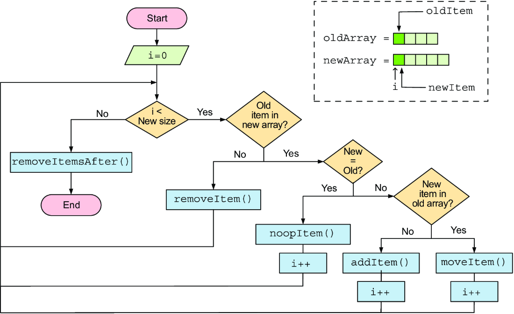

##### Example

```
oldArray = [X,A,A,B,C]  
newArray = [C,K,A,B]
```

Step 1: (i=0)  


Step 2: (i=0)  


STEP 3 (I=1)  
add K in the new array.  


STEP 4 (I=2)  
At i=2, both arrays have an A but A moved naturally (noop):  


STEP 5 (I=3)  
At i=3, B should be moved at i=4  


STEP 6  
At i=4 in the old array the extra A is removed  


#### Algorithm Implementation

##### `ARRAY_DIFF_OP`

```javascript
// FILE: utils/arrays.js
export const ARRAY_DIFF_OP = {
    ADD: 'add',
    REMOVE: 'remove',
    MOVE: 'move',
    NOOP: 'noop',
}
```

##### `ArrayWithOriginalIndices` class

The Wrapper class for the old array

```javascript
// We use a wrapper class for the old array so that we can keep track of its original indexes inside
class ArrayWithOriginalIndices {
    #array = []
    #originalIndices = []
    #equalsFn

    constructor(array, equalsFn) {
        this.#array = [...array]  // The internal array is a copy of the original.
        this.#originalIndices = array.map((_, i) => i) // Keeps track of the original indices
        this.#equalsFn = equalsFn // Saves the function used to compare items in the array
    }

    get length() {
        return this.#array.length // The current length of the array
    }
}
```

##### `arraysDiffSequence` function

```javascript
// The equalsFn is used to compare items in the array
export function arraysDiffSequence(oldArray, newArray, equalsFn = (a, b) => a === b) {
    const sequence = []
    const array = new ArrayWithOriginalIndices(oldArray, equalsFn) // Wraps the old array in an ArrayWithOriginalIndices

    for (let index = 0; index < newArray.length; index++) {  // Iterates the indices of the new array

        // TO-DO: removal case
        // TO-DO: noop case
        // TO-DO: addition case
        // TO-DO: move case
    }

    // TO-DO: remove extra items 

    return sequence // Returns the sequence of operations
}
```

##### The Remove Case and `isRemoval()` & `removeItem` methods inside `ArrayWithOriginalIndices` class

If item was removed check whether the item in the old array at the current index doesn’t exist in the new array.

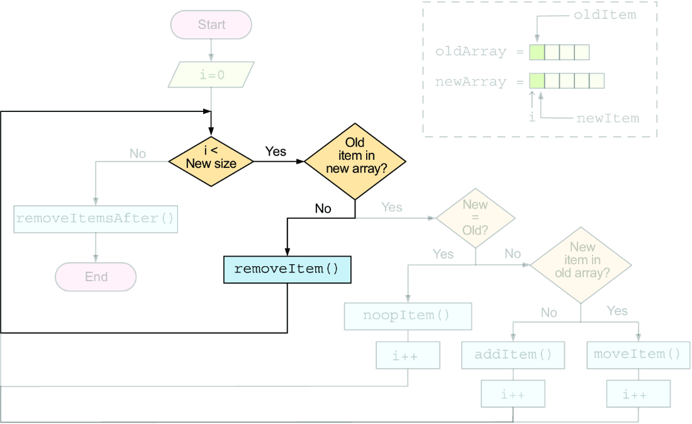

```javascript
class ArrayWithOriginalIndices {

    // ...

    // Checks if the object needs to be removed 
    isRemoval(index, newArray) {

        // If the index is out of bounds, there's nothing to remove.
        if (index >= this.length) {
            return false
        }

        // Gets the item in the old array at the given index
        const item = this.#array[index]

        // Tries to find the same item in the new array, returning its i
        const indexInNewArray = newArray.findIndex((newItem) =>
            // Uses the #equalsFn to compare the items
            this.#equalsFn(item, newItem)
        )

        // If the index is -1, the item was removed.
        return indexInNewArray === -1
    }
}
```

```javascript
class ArrayWithOriginalIndices {

    // ...

    //Removes the item with the provided id
    removeItem(index) {
        // Creates the operation for the removal
        const operation = {
            op: ARRAY_DIFF_OP.REMOVE,
            index,
            // The current index of the item in the old array (not the original index)
            item: this.#array[index],
        }

        // Removes the item from the array
        this.#array.splice(index, 1)

        // Removes the original index of the item
        this.#originalIndices.splice(index, 1)

        // Returns the operation
        return operation
    }
}
```

Lastly we add this in the `arraysDiffSequence` function

```
// Checks whether the item in the old array at the current index was removed
if (array.isRemoval(index, newArray)) {
    // Removes the item and pushes the operation to the sequence
    sequence.push(array.removeItem(index))
    // Decrements the index to stay at the same index in the next iteration
    index--
    continue
}
```


##### The noop Case and `originalIndexAt()` & `isNoop()` & `noopItem()` methods inside `ArrayWithOriginalIndices` class

The noop case happens when, at the current index, both the old and new arrays have the same item.

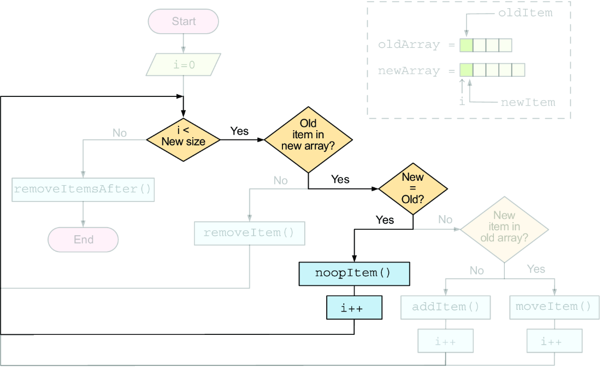


```javascript
class ArrayWithOriginalIndices {
    
    // ...

    // Checks if the item doesn't need operation
    isNoop(index, newArray) {
        // If the index is out of bounds, there can't be a noop.
        if (index >= this.length) {
            return false
        }
        // The item in the old array
        const item = this.#array[index]

        // The item in the new array
        const newItem = newArray[index]

        // Checks whether the items are equal
        return this.#equalsFn(item, newItem)
    }
}
```


```javascript
class ArrayWithOriginalIndices {
    
    // ...
    
    originalIndexAt(index) {
        // Returns the original index of the item in the old array
        return this.#originalIndices[index]
    }

    noopItem(index) {

        // Creates the noop operation
        return {
            op: ARRAY_DIFF_OP.NOOP,

            // Adds the original index to the operation
            originalIndex: this.originalIndexAt(index),
            index,

            // Includes the item in the operation
            item: this.#array[index],
        }
    }
}
```

Lastly we add this in the `arraysDiffSequence` function

```
// Checks whether the operation is a noop
if (array.isNoop(index, newArray)) {
    // Pushes the noop operation to the sequence\\
    sequence.push(array.noopItem(index))
    continue
}
```


##### The Addition Case and `findIndexFrom()` & `isAddition()` & `addItem()` methods inside `ArrayWithOriginalIndices` class

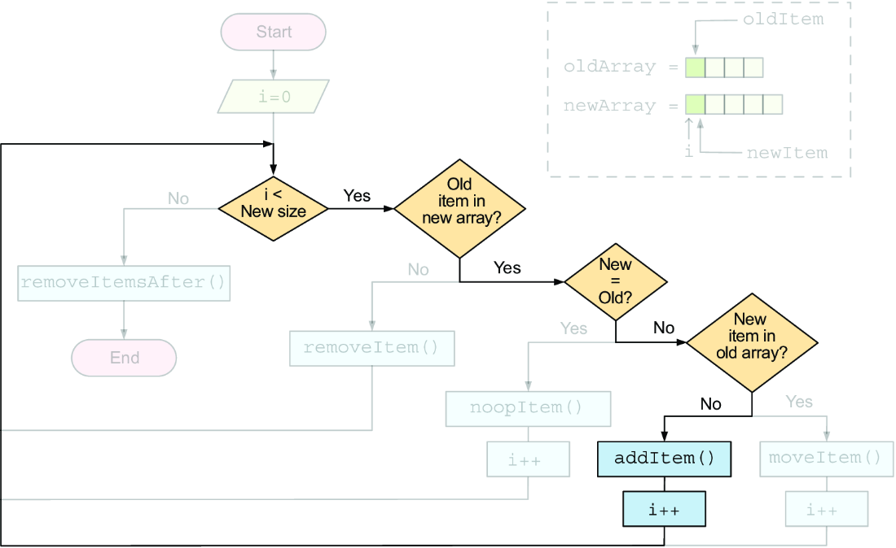


```javascript
class ArrayWithOriginalIndices {
 
    // ...

    findIndexFrom(item, fromIndex) {

        // Starts looking from the given index\\
        for (let i = fromIndex; i < this.length; i++) {
            // If the item at the index i equals the given one, returns i
            if (this.#equalsFn(item, this.#array[i])) {
                return i
            }
        }
        // Returns -1 if the item wasn't found\\
        return -1
    }

    // Checks whether the item exists starting at the given index\\
    isAddition(item, fromIdx) {
        return this.findIndexFrom(item, fromIdx) === -1
    }

    addItem(item, index) {
        // Creates the add operation
        const operation = {
            op: ARRAY_DIFF_OP.ADD,
            index,
            item,
        }

        // Adds the new item to the old array at the given index
        this.#array.splice(index, 0, item)

        // Adds a -1 index to the #originalIndices array at the given in
        this.#originalIndices.splice(index, 0, -1)

        // Returns the add operation
        return operation
    }


}
```


Lastly we add this in the `arraysDiffSequence` function
```
// Gets the item in the new array at the current index
const item = newArray[index]

// Checks whether the case is an addition
if (array.isAddition(item, index)) {
    
    // Appends the add operation to the sequence
    sequence.push(array.addItem(item, index))
    
    // Continues with the loop
    continue
}
```


##### The Move Case and `moveItem()` method inside `ArrayWithOriginalIndices` class


if the operation isn’t a **remove**, an **add**, or a **noop**, it must be a **_move_**.

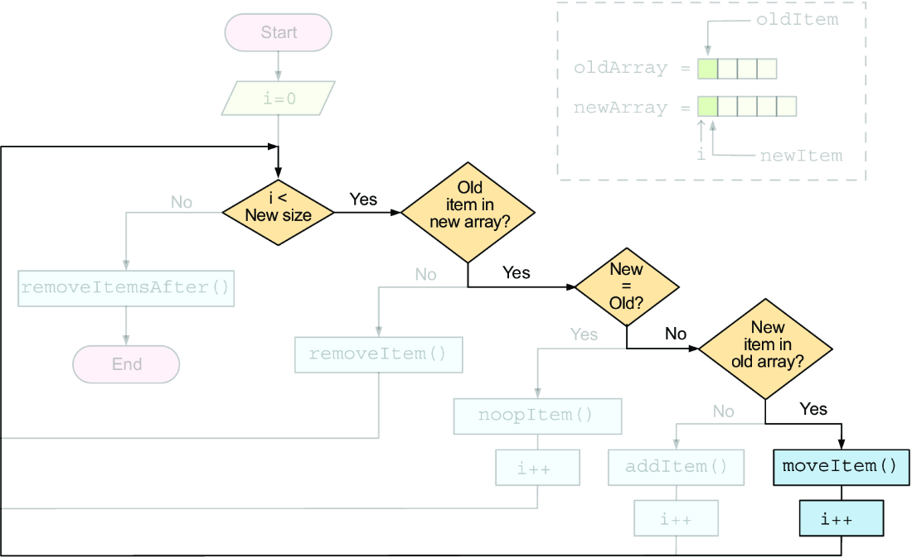

To move an item:
- you want to extract it from the array
- insert it into the new position

Two things in mind:
- move the original index to its new position,
- have to include the original index in the move operation.


```javascript
class ArrayWithOriginalIndices {
    
    // ...

    moveItem(item, toIndex) {

        // Looks for the item in the old array, starting from the target
        const fromIndex = this.findIndexFrom(item, toIndex)

        // Creates the move operation
        const operation = {
            op: ARRAY_DIFF_OP.MOVE,

            // Includes the original index in the operation
            originalIndex: this.originalIndexAt(fromIndex),
            from: fromIndex,
            index: toIndex,
            item: this.#array[fromIndex],
        }
        // Extracts the item from the old array
        const [_item] = this.#array.splice(fromIndex, 1)

        // Inserts the item into the new position
        this.#array.splice(toIndex, 0, _item)

        // Extracts the original index from the #originalIndices array
        const [originalIndex] =this.#originalIndices.splice(fromIndex, 1)

        // Inserts the original index into the new position
        this.#originalIndices.splice(toIndex, 0, originalIndex)

        // Returns the move operation
        return operation
    }

}
```

Lastly we add this in the `arraysDiffSequence` function

```
sequence.push(array.moveItem(item, index))
```

##### Remove Remaining elements case 

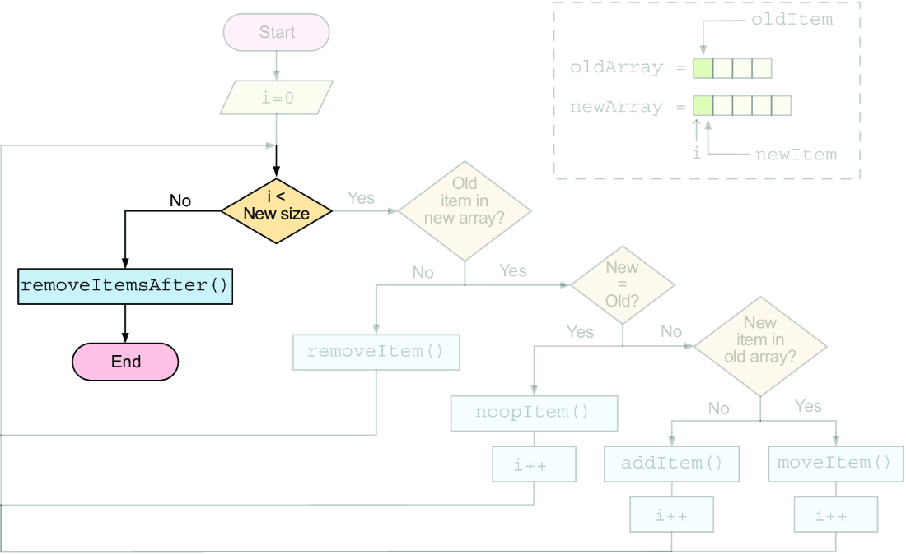


```javascript
class ArrayWithOriginalIndices {

    // ...
    
    removeItemsAfter(index) {
        const operations = []

        // Keeps removing items while the old array is longer than the i
        while (this.length > index) {

            // Adds the removal operation to the array\\
            operations.push(this.removeItem(index))
        }
        // Returns the removal operations\\
        return operations
    }

}
```

Lastly we add this in the `arraysDiffSequence` function

```
sequence.push(...array.removeItemsAfter(newArray.length))
```

#### Algorithm Whole Code

##### `arraysDiffSequence()` function

The code for the `arraysDiffSequence` that will return the sequence of operations needed for the transformation
```javascript
// The equalsFn is used to compare items in the array
export function arraysDiffSequence(oldArray, newArray, equalsFn = (a, b) => a === b) {
    const sequence = []
    const array = new ArrayWithOriginalIndices(oldArray, equalsFn) // Wraps the old array in an ArrayWithOriginalIndices

    for (let index = 0; index < newArray.length; index++) {  // Iterates the indices of the new array

        // Checks whether the item in the old array at the current index was removed
        if (array.isRemoval(index, newArray)) {
            // Removes the item and pushes the operation to the sequence
            sequence.push(array.removeItem(index))
            // Decrements the index to stay at the same index in the next iteration
            index--
            continue
        }

        // Checks whether the operation is a noop
        if (array.isNoop(index, newArray)) {
            // Pushes the noop operation to the sequence\\
            sequence.push(array.noopItem(index))
            continue
        }

        // Gets the item in the new array at the current index
        const item = newArray[index]

        // Checks whether the case is an addition
        if (array.isAddition(item, index)) {

            // Appends the add operation to the sequence
            sequence.push(array.addItem(item, index))

            // Continues with the loop
            continue
        }

        sequence.push(array.moveItem(item, index))
    }

    sequence.push(...array.removeItemsAfter(newArray.length))

    return sequence // Returns the sequence of operations
}
```

---

##### `ArrayWithOriginalIndices` class

The code of the wrapper class `ArrayWithOriginalIndices` that holds the methods for add,remove,add...

```javascript
// We use a wrapper class for the old array so that we can keep track of its original indexes inside
class ArrayWithOriginalIndices {
    #array = []
    #originalIndices = []
    #equalsFn

    constructor(array, equalsFn) {
        this.#array = [...array]  // The internal array is a copy of the original.
        this.#originalIndices = array.map((_, i) => i) // Keeps track of the original indices
        this.#equalsFn = equalsFn // Saves the function used to compare items in the array
    }

    get length() {
        return this.#array.length // The current length of the array
    }

    // Checks if the object needs to be removed
    isRemoval(index, newArray) {

        // If the index is out of bounds, there's nothing to remove.
        if (index >= this.length) {
            return false
        }

        // Gets the item in the old array at the given index
        const item = this.#array[index]

        // Tries to find the same item in the new array, returning its i
        const indexInNewArray = newArray.findIndex((newItem) =>
            // Uses the #equalsFn to compare the items
            this.#equalsFn(item, newItem)
        )

        // If the index is -1, the item was removed.
        return indexInNewArray === -1
    }

    //Removes the item with the provided id
    removeItem(index) {
        // Creates the operation for the removal
        const operation = {
            op: ARRAY_DIFF_OP.REMOVE,
            index,
            // The current index of the item in the old array (not the original index)
            item: this.#array[index],
        }

        // Removes the item from the array
        this.#array.splice(index, 1)

        // Removes the original index of the item
        this.#originalIndices.splice(index, 1)

        // Returns the operation
        return operation
    }

    // Checks if the item doesn't need operation
    isNoop(index, newArray) {
        // If the index is out of bounds, there can't be a noop.
        if (index >= this.length) {
            return false
        }
        // The item in the old array
        const item = this.#array[index]

        // The item in the new array
        const newItem = newArray[index]

        // Checks whether the items are equal
        return this.#equalsFn(item, newItem)
    }


    originalIndexAt(index) {
        // Returns the original index of the item in the old array
        return this.#originalIndices[index]
    }

    noopItem(index) {

        // Creates the noop operation
        return {
            op: ARRAY_DIFF_OP.NOOP,

            // Adds the original index to the operation
            originalIndex: this.originalIndexAt(index),
            index,

            // Includes the item in the operation
            item: this.#array[index],
        }
    }

    findIndexFrom(item, fromIndex) {

        // Starts looking from the given index\\
        for (let i = fromIndex; i < this.length; i++) {
            // If the item at the index i equals the given one, returns i
            if (this.#equalsFn(item, this.#array[i])) {
                return i
            }
        }
        // Returns -1 if the item wasn't found\\
        return -1
    }

    // Checks whether the item exists starting at the given index\\
    isAddition(item, fromIdx) {
        return this.findIndexFrom(item, fromIdx) === -1
    }

    addItem(item, index) {
        // Creates the add operation
        const operation = {
            op: ARRAY_DIFF_OP.ADD,
            index,
            item,
        }

        // Adds the new item to the old array at the given index
        this.#array.splice(index, 0, item)

        // Adds a -1 index to the #originalIndices array at the given in
        this.#originalIndices.splice(index, 0, -1)

        // Returns the add operation
        return operation
    }

    moveItem(item, toIndex) {

        // Looks for the item in the old array, starting from the target
        const fromIndex = this.findIndexFrom(item, toIndex)

        // Creates the move operation
        const operation = {
            op: ARRAY_DIFF_OP.MOVE,

            // Includes the original index in the operation
            originalIndex: this.originalIndexAt(fromIndex),
            from: fromIndex,
            index: toIndex,
            item: this.#array[fromIndex],
        }
        // Extracts the item from the old array
        const [_item] = this.#array.splice(fromIndex, 1)

        // Inserts the item into the new position
        this.#array.splice(toIndex, 0, _item)

        // Extracts the original index from the #originalIndices array
        const [originalIndex] =this.#originalIndices.splice(fromIndex, 1)

        // Inserts the original index into the new position
        this.#originalIndices.splice(toIndex, 0, originalIndex)

        // Returns the move operation
        return operation
    }


    removeItemsAfter(index) {
        const operations = []

        // Keeps removing items while the old array is longer than the i
        while (this.length > index) {

            // Adds the removal operation to the array\\
            operations.push(this.removeItem(index))
        }
        // Returns the removal operations\\
        return operations
    }

}
```

---

## Summary

The reconciliation algorithm has two main steps:
- **_diffing_** - finding the differences between two virtual trees;
- **_patching_** - applying the differences to the real DOM;